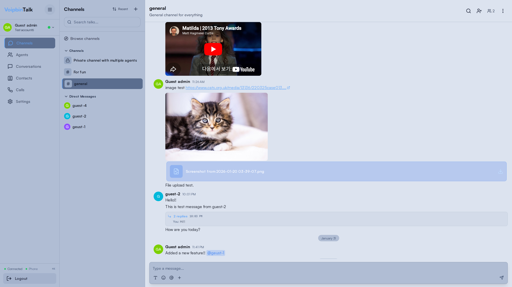
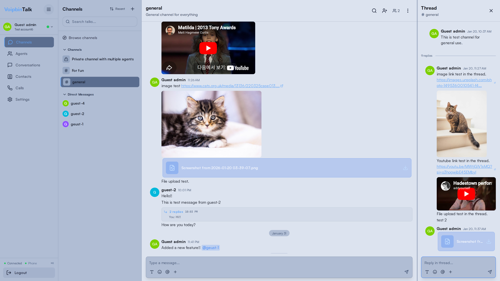
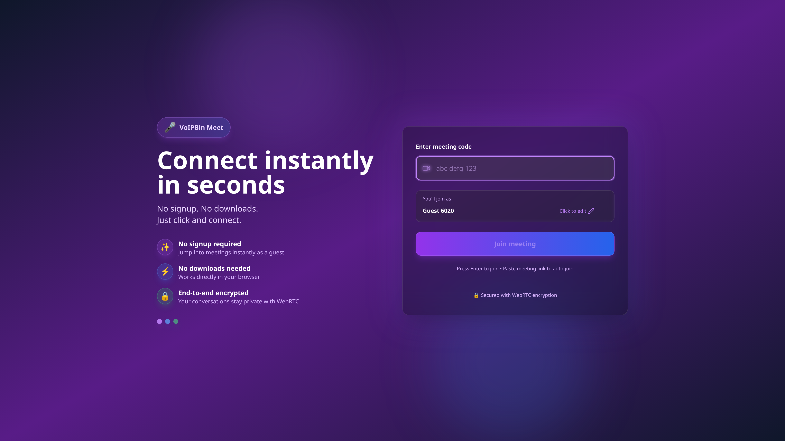
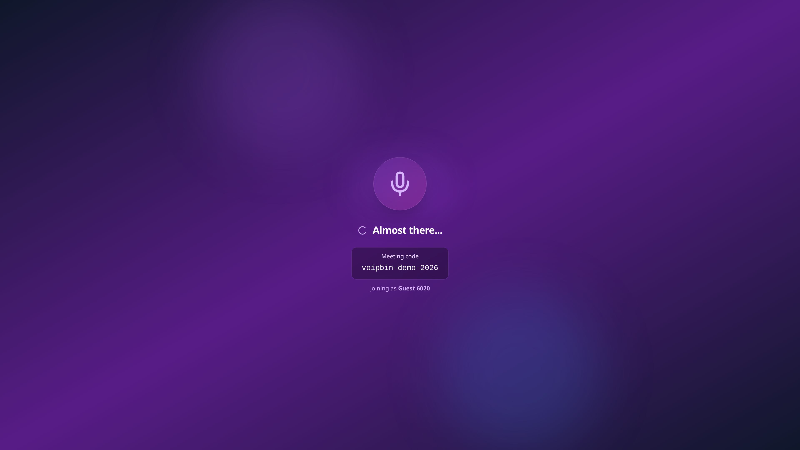

<p align="center">
  <a href="https://voipbin.net">
    
  </a>
</p>

<h1 align="center">VoIPBin</h1>

<h3 align="center">The Open-Source CPaaS Platform</h3>

<p align="center">
Build, deploy, and scale voice, messaging, and video applications — fully self-hosted, API-first, and designed for developers.
</p>

<p align="center">
  <a href="https://voipbin.net">Website</a> •
  <a href="https://api.voipbin.net/docs/">API Docs</a> •
  <a href="https://admin.voipbin.net">Admin Console</a> •
  <a href="https://talk.voipbin.net">Talk</a> •
  <a href="https://meet.voipbin.net">Meet</a> •
  <a href="https://youtu.be/9VKu_QMFzko">Demo Video</a>
</p>

<p align="center">
  <a href="https://admin.voipbin.net"></a>
  <a href="https://github.com/voipbin/voipbin/stargazers"></a>
  <a href="https://circleci.com/gh/voipbin/monorepo"></a>
  <a href="https://github.com/voipbin/voipbin/blob/main/LICENSE"></a>
  <a href="https://github.com/voipbin/monorepo"></a>
  <a href="https://github.com/voipbin/voipbin/issues"></a>
</p>

<p align="center">
  <b>🟢 Live production instance:</b> <a href="https://admin.voipbin.net">admin.voipbin.net</a> — Try it now with the built-in <b>guest account</b> (no signup required)
</p>

<br />

<p align="center">
  <a href="https://admin.voipbin.net">
    
  </a>
</p>

---

## Why VoIPBin?

Most CPaaS platforms come with trade-offs: vendor lock-in, unpredictable pricing, and zero infrastructure control. Most open-source alternatives stop at SIP or require gluing together unrelated projects.

**VoIPBin is different.** It's a complete, production-grade CPaaS built from the ground up — 34 microservices running on Kubernetes, with modern programmable APIs, fully open-source and self-hostable.

> _“Own your communications stack.”_ — Run your own CPaaS with full API control.

### Key Benefits

- 🏭 **Production-ready today** — Serving real traffic at voipbin.net
- 🔓 **Truly open-source** — MIT Licensed, no open-core bait-and-switch
- 🧩 **All-in-one platform** — Voice, SMS, Video, AI, Queues, Campaigns, Team Messaging, Meetings
- 🤖 **AI-native** — Built-in assistants, real-time transcription, intelligent routing
- 🏢 **Multi-tenant by design** — Full customer isolation, billing, access control
- ☸️ **Cloud-native** — Kubernetes-first, scales horizontally
- 📞 **Carrier-grade voice** — Asterisk + Kamailio + RTPEngine with SRTP, OPUS, WebRTC
- 🛡️ **Data sovereignty** — Deploy on your own infrastructure

---

## Features

VoIPBin provides everything your communications stack needs in a unified platform.

<table>
<tr>
<th>📞 Voice & Telephony</th>
<th>💬 Messaging & Channels</th>
<th>🤖 AI & Intelligence</th>
</tr>
<tr>
<td>
- Programmable Call Flows (JSON)
- Call Queues & Agents
- Call Recording & Transcription
- Conferencing (audio/video)
- Extension Management (SIP/WebRTC)
- Carrier-grade media (SRTP, OPUS, PCMU/PCMA)
</td>
<td>
- SMS & Messaging Flows
- Chat & Web Messaging
- Email Integration
- Webhook & HTTP
- Campaign Automation (bulk voice/SMS)
- Inbound & Outbound
</td>
<td>
- AI-Powered Voice Assistants
- Real-time Transcription
- Post-call Summarization
- Intelligent Flow Routing
- RAG-backed Assistants
- MCP Integration (plug into any AI agent)
</td>
</tr>
<tr>
<th>💼 Talk — Team Collaboration</th>
<th>🎥 Meet — Video Conferencing</th>
<th>🏢 Platform & Operations</th>
</tr>
<tr>
<td>
- Channels & Threaded Replies
- Rich Media Sharing (images, videos, files, links)
- Integrated Voice Calls (place/receive from app)
- Agent Workspace (unified inbox)
- Multi-tenant Messaging
- Web-based (no install)
</td>
<td>
- Browser-based Video Calls (WebRTC)
- HD Audio & Video
- Screen Sharing & Presentations
- Moderation Tools (host controls)
- Shareable Links
- Integrated with Voice (escalate chats to video)
</td>
<td>
- Multitenancy (isolated configs per tenant)
- Billing Management (usage tracking)
- Number Management (provisioning & routing)
- Role-based Access Control
- Observability (metrics, logs, tracing)
- API-first (everything scriptable via REST)
</td>
</tr>
</table>

---

## See It in Action

VoIPBin ships with three production-ready applications — Admin Console, Talk, and Meet — all backed by the same API and microservices.

<table>
<tr>
<td align="center" width="33%">
  <a href="https://talk.voipbin.net"><b>💼 Talk</b></a><br/>
  Team messaging & calls
</td>
<td align="center" width="33%">
  <a href="https://meet.voipbin.net"><b>🎥 Meet</b></a><br/>
  Video conferencing
</td>
<td align="center" width="33%">
  <a href="https://admin.voipbin.net"><b>🔧 Admin Console</b></a><br/>
  Operator workspace
</td>
</tr>
</table>

<p align="center">
  <a href="https://talk.voipbin.net">
    
  </a>
  <a href="https://talk.voipbin.net">
    
  </a>
  <a href="https://meet.voipbin.net">
    
  </a>
  <a href="https://meet.voipbin.net">
    
  </a>
</p>

<p align="center">
  <a href="https://youtu.be/9VKu_QMFzko">
    
  </a>
  <br/>
  <a href="https://youtu.be/9VKu_QMFzko">▶️ Watch the full demo video</a>
</p>

---

## Getting Started

<table>
<tr>
<td align="center" width="50%">
### ☁️ VoIPBin Cloud
**The fastest way to get started.**

Use VoIPBin as a fully managed service — no infrastructure to set up, no servers to maintain. Just sign up and start building.

✅ Instant setup — start in minutes
✅ No infrastructure management
✅ Auto-scaling & high availability
✅ Always up-to-date
✅ Demo account available

<a href="https://admin.voipbin.net"><b>🔗 Try VoIPBin Cloud →</b></a>
</td>
<td align="center" width="50%">
### 🏠 Self-Install
**Full control over your infrastructure.**

Deploy VoIPBin on your own cloud infrastructure. Own your data, customize everything, and run it wherever you want.

✅ Complete data ownership
✅ Currently supports GCP (AWS, Azure planned)
✅ Full customization & white-labeling
✅ No usage-based fees
✅ Air-gapped / private network support

<a href="#-self-install-guide"><b>🔗 Self-Install Guide →</b></a>
</td>
</tr>
</table>

### Self-Install Quick Start

```bash
# 1. Clone the installer
git clone https://github.com/voipbin/install.git
cd install
pip install -r requirements.txt

# 2. Interactive setup wizard (7 questions)
./voipbin-install init

# 3. Deploy everything
./voipbin-install apply

# 4. Verify deployment health
./voipbin-install verify
```

The installer handles Terraform (infrastructure), Ansible (VM config), and Kubernetes (34 backend services + VoIP layer).

---

## Architecture

VoIPBin is built as a distributed system of **34 Go microservices** communicating via message queues and REST APIs, all orchestrated on Kubernetes.

```
┌─────────────────────────────────────────────────────────┐
│                     Client Layer                         │
│   Admin Console  •  Talk  •  Meet  •  SDK  •  REST API  │
└────────────────────────┬────────────────────────────────┘
                         │
┌────────────────────────▼────────────────────────────────┐
│                    API Gateway                           │
│              (bin-api-manager)                           │
└────────────────────────┬────────────────────────────────┘
                         │
┌────────────────────────▼────────────────────────────────┐
│              Core Microservices                          │
│                                                         │
│  ┌──────────┐ ┌──────────┐ ┌──────────┐ ┌──────────┐  │
│  │   Call    │ │   Flow   │ │   AI     │ │  Queue   │  │
│  │ Manager  │ │ Manager  │ │ Manager  │ │ Manager  │  │
│  └──────────┘ └──────────┘ └──────────┘ └──────────┘  │
│                                                         │
│  ┌──────────┐ ┌──────────┐ ┌──────────┐ ┌──────────┐  │
│  │ Campaign │ │Conference│ │ Message  │ │ Customer │  │
│  │ Manager  │ │ Manager  │ │ Manager  │ │ Manager  │  │
│  └──────────┘ └──────────┘ └──────────┘ └──────────┘  │
│                                                         │
│  ┌──────────┐ ┌──────────┐ ┌──────────┐ ┌──────────┐  │
│  │ Billing  │ │  Number  │ │   Talk   │ │  Hook    │  │
│  │ Manager  │ │ Manager  │ │ Manager  │ │ Manager  │  │
│  └──────────┘ └──────────┘ └──────────┘ └──────────┘  │
│                                                         │
│         ... and 22 more microservices                  │
└────────────────────────┬────────────────────────────────┘
                         │
┌────────────────────────▼────────────────────────────────┐
│                 Media & VoIP Layer                       │
│       Asterisk  •  Kamailio  •  RTPEngine               │
└─────────────────────────────────────────────────────────┘
```

---

## Repositories

| Repository | Description |
|------------|-------------|
| **[voipbin/voipbin](https://github.com/voipbin/voipbin)** | Project overview and documentation |
| **[voipbin/install](https://github.com/voipbin/install)** | Self-install guide and deployment scripts |
| **[voipbin/monorepo](https://github.com/voipbin/monorepo)** | Backend microservices (34 Go services) |
| **[voipbin/voipbin-go](https://github.com/voipbin/voipbin-go)** | Go SDK for VoIPBin API |
| **[voipbin/mcp](https://github.com/voipbin/mcp)** | MCP (Model Context Protocol) server |
| **[voipbin/sandbox](https://github.com/voipbin/sandbox)** | Sandbox & examples |

---

## Roadmap

- [x] Programmable voice flows with JSON-based logic
- [x] SMS & messaging flow engine
- [x] AI-powered voice assistants
- [x] Real-time transcription & summarization
- [x] Multi-tenant platform with billing
- [x] Outbound campaign engine
- [x] Team messaging with threads and media sharing (**Talk**)
- [x] Video conferencing (**Meet** / WebRTC)
- [x] MCP server for AI agent integration
- [x] Terraform-based cloud deployment (GCP)
- [ ] Docker Compose quick-start for easy local setup
- [ ] AWS & Azure support
- [ ] Plugin/extension marketplace
- [ ] SDKs for Python, JavaScript, Java
- [ ] Hosted free tier at voipbin.net

> 💡 Have an idea? [Open an issue](https://github.com/voipbin/voipbin/issues) — we'd love to hear from you!

---

## Contact

- 🌐 Website: [voipbin.net](https://voipbin.net)
- 📧 Email: [support@voipbin.net](mailto:support@voipbin.net)
- 🐙 GitHub: [@voipbin](https://github.com/voipbin)

---

## License

VoIPBin is open-source software licensed under the [MIT License](LICENSE).

<p align="center">
  <sub>Built with ❤️ by <a href="https://github.com/pchero">@pchero</a> — CPaaS for All</sub>
</p>