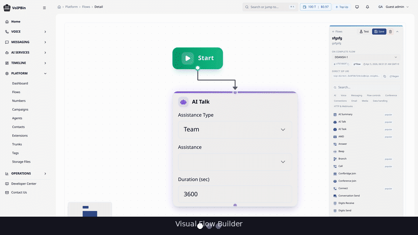
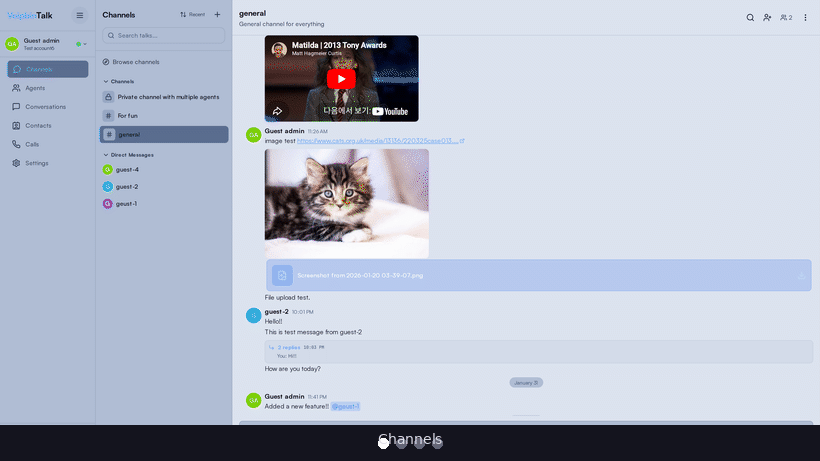
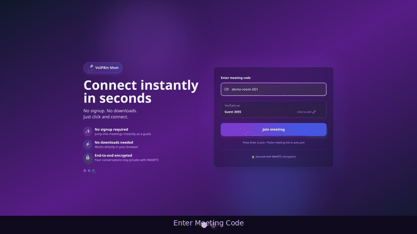

<p align="center">
  <a href="https://voipbin.net">
    
  </a>
</p>

<h1 align="center">VoIPBin</h1>

<h3 align="center">The Opensource CPaaS Platform. Built for Enterprises, Open for Everyone.</h3>

<p align="center">
A complete, production-grade Communications Platform as a Service: <b>Voice</b>, <b>SMS</b>, <b>AI</b>, <b>Team Messaging</b>, and <b>Conferencing</b>. Fully self-hostable, API-first, and running in production today.
</p>

<p align="center">
  <a href="https://voipbin.net">Website</a> •
  <a href="https://api.voipbin.net/docs/">API Docs</a> •
  <a href="https://admin.voipbin.net">Admin Console</a> •
  <a href="https://talk.voipbin.net">Talk</a> •
  <a href="https://meet.voipbin.net">Meet</a> •
  <a href="https://discord.com/invite/waztvb63Yx">Discord</a>
</p>

<p align="center">
  <a href="https://admin.voipbin.net"></a>
  <a href="https://github.com/voipbin/voipbin/stargazers"></a>
  <a href="https://circleci.com/gh/voipbin/monorepo"></a>
  <a href="https://github.com/voipbin/voipbin/blob/main/LICENSE"></a>
  <a href="https://github.com/voipbin/monorepo"></a>
  <a href="https://github.com/voipbin/install/releases"></a>
  <a href="https://github.com/voipbin/monorepo/commits/main"></a>
  <a href="https://github.com/voipbin/monorepo/commits/main"></a>
  <a href="https://github.com/voipbin/voipbin/issues"></a>
  <a href="https://discord.com/invite/waztvb63Yx"></a>
</p>

<p align="center">
  <b>🟢 Live production instance:</b> <a href="https://admin.voipbin.net">admin.voipbin.net</a>. Try it now with the built-in <b>guest account</b> (no signup required)
</p>

<br />

<p align="center">
  <a href="https://admin.voipbin.net">
    
  </a>
</p>

<p align="center">
  <sub>
    <a href="#why-voipbin">Why</a> ·
    <a href="#-who-is-voipbin-for">Who it's for</a> ·
    <a href="#-features--a-unified-cpaas-not-a-collection-of-parts">Features</a> ·
    <a href="#-see-it-in-action">Demo</a> ·
    <a href="#-two-ways-to-use-voipbin">Cloud or Self-host</a> ·
    <a href="#-voipbin-cloud--quick-start">Quick Start</a> ·
    <a href="#-architecture">Architecture</a> ·
    <a href="#-security--data-sovereignty">Security</a> ·
    <a href="#-repositories">Repos</a>
  </sub>
</p>

---

## Why VoIPBin?

**Most CPaaS platforms come with trade-offs**: vendor lock-in, unpredictable pricing, and zero control over your infrastructure. Most opensource alternatives either stop at SIP or require gluing together a dozen unrelated projects.

**VoIPBin is different.** It's the **only production-grade, self-hostable, all-in-one CPaaS**. Voice, messaging, AI, team collaboration, and audio conferencing in a single coherent platform. 34 Go microservices running on Kubernetes, backed by Asterisk, Kamailio, and RTPEngine, fully released as opensource software under MIT.

> _"Own your communications stack."_ Run your own CPaaS with full API control and zero vendor lock-in.

### What makes VoIPBin enterprise-ready:

- 🏭 **Running in production today**. Serving real traffic at [voipbin.net](https://voipbin.net), not a weekend prototype
- 🔓 **Truly opensource**. MIT Licensed, no "open-core" bait-and-switch, every component is in the repo
- 🧩 **Complete platform, not a toolkit**. Voice, SMS, AI, Queues, Campaigns, Team Messaging, Meetings, all integrated
- 🤖 **AI-native**. Built-in AI assistants, real-time transcription, post-call summarization, intelligent routing
- 🏢 **Multi-tenant by design**. Full customer isolation, billing, quotas, and access control out of the box
- ☸️ **Cloud-native and horizontally scalable**. Kubernetes-first, stateless services, message-queue backbone
- 📞 **Carrier-grade voice**. Asterisk + Kamailio + RTPEngine with SRTP, OPUS, PCMU/PCMA, WebRTC
- 🛡️ **Data sovereignty**. Deploy on your own infrastructure. No data leaves your cloud.

---

## 👥 Who is VoIPBin For?

VoIPBin is built for teams who need **real communications infrastructure**, not a wrapper around someone else's API.

<table>
<tr>
<td width="50%">

### 🏢 SaaS & Product Teams
**Embed voice, SMS, and chat into your product** without paying per-minute markups for the rest of your life. Multi-tenant from day one, isolating every customer with native billing, quotas, and access control.

> _"We were paying $40k/mo to a CPaaS vendor for features we could now own."_

</td>
<td width="50%">

### 📞 Contact Centers & BPOs
**Run inbound/outbound campaigns at scale** with programmable flows, agent queues, real-time transcription, and AI-powered post-call summaries. Full agent workspace included via Talk.

> _"Replace your legacy ACD without replacing your phone numbers."_

</td>
</tr>
<tr>
<td width="50%">

### 🤖 AI Agent Builders
**Connect any LLM to a real phone line.** Built-in MCP server, RAG-backed assistants, real-time STT/TTS, and a flow engine that handles call routing while your AI handles the conversation.

> _"The fastest path from `gpt-4` to `+1-555-...`."_

</td>
<td width="50%">

### 🌍 Telecom Operators & ISVs
**White-label a complete CPaaS** under your own brand. Bring your own carriers, deploy in your own region, comply with local data residency rules. Air-gapped deployments supported.

> _"Self-hostable means you actually own the customer relationship."_

</td>
</tr>
</table>

---

## 🔐 Security & Data Sovereignty

Communications data is sensitive. VoIPBin is engineered so you stay in control of it.

- **🏠 Self-hostable, fully**. Every component (backend, frontend, telephony, databases) runs in your cloud. Air-gapped deployments supported.
- **🔒 Encrypted media**. SRTP for voice, TLS for signaling and APIs end-to-end.
- **🗝️ Secrets management**. Configuration encrypted at rest with [SOPS](https://github.com/getsops/sops). No plaintext credentials in the repo or runtime.
- **🪪 Multi-tenant isolation**. Every customer's data, flows, and credentials are isolated at the database layer, not just the API.
- **🌐 Data residency**. You pick the region. Data never leaves your VPC.
- **📜 Auditable**. 100% MIT-licensed source. Inspect every line, fork freely, host anywhere.

> No managed-service backdoors. No "phone home" telemetry. No usage caps that hold your data hostage.

---

## ✨ Features. A Unified CPaaS, Not a Collection of Parts

Everything your communications stack needs, built to work together out of the box.

<table>
<tr>
<td width="50%">

### 📞 Voice & Telephony
- **Programmable Call Flows**. Design advanced call logic with branching, loops, and post-call hooks using declarative JSON
- **Call Queues & Agents**. Priority-based routing, ring strategies, agent login/logout
- **Call Recording**. Record, transcribe, and summarize conversations
- **Conferencing**. Secure real-time audio with moderation tools
- **Extension Management**. SIP/WebRTC registration and routing
- **Carrier-grade media**. SRTP, OPUS, PCMU/PCMA codecs

</td>
<td width="50%">

### 💬 Messaging & Channels
- **SMS & Messaging Flows**. Same powerful flow engine for messages
- **Chat & Web Messaging**. Real-time customer-agent communication
- **Email Integration**. Multichannel notification support
- **Webhook & HTTP**. Trigger actions and integrate with external services
- **Campaign Automation**. Bulk voice/SMS campaigns via API
- **Inbound & Outbound**. Full two-way communication support

</td>
</tr>
<tr>
<td width="50%">

### 🤖 AI & Intelligence
- **AI-Powered Voice Assistants**. Conversational AI with smart action triggers
- **Real-time Transcription**. Live speech-to-text during calls
- **Post-call Summarization**. AI-generated call summaries
- **Intelligent Flow Routing**. Context-aware decision making
- **RAG-backed Assistants**. Ground AI in your knowledge base
- **MCP Integration**. Plug VoIPBin into any AI agent via Model Context Protocol

</td>
<td width="50%">

### 💼 Talk. Team Collaboration
- **Channels & Threads**. Organized team messaging with threaded replies
- **Rich Media Sharing**. Images, files, and link previews
- **Integrated Voice Calls**. Place and receive calls without leaving the app
- **Agent Workspace**. Unified inbox for chats, calls, and tasks
- **Multi-tenant Messaging**. Isolated workspaces per customer
- **Web-based, no installs**. Works in any modern browser

</td>
</tr>
<tr>
<td width="50%">

### 🎙️ Meet. Audio Conferencing
- **Browser-based Audio Calls**. No downloads, works everywhere via WebRTC
- **HD Audio**. Low-latency real-time voice
- **Moderation Tools**. Host controls, mute, remove participants
- **Shareable Links**. Join meetings via simple URL
- **Multi-tenant**. Isolated meeting spaces per workspace
- **Integrated with Voice**. Escalate chats into full audio meetings

</td>
<td width="50%">

### 🏢 Platform & Operations
- **Multitenancy**. Isolated configs, flows, agents per tenant
- **Billing Management**. Built-in usage tracking and billing
- **Number Management**. Phone number provisioning and routing
- **Role-based Access Control**. Fine-grained permissions
- **Observability**. Metrics, logs, and tracing hooks
- **API-first**. Everything is scriptable via REST API

</td>
</tr>
</table>

---

## 🎬 See It in Action

VoIPBin ships with three production-ready applications, all backed by the same API and microservices layer.

### 🔧 Admin Console. Build and Manage Your CPaaS

The operator workspace for building call flows, managing AI assistants, configuring agents, and monitoring your entire communications stack.

<a href="https://admin.voipbin.net"><b>🔧 Try Admin Console →</b></a> &nbsp;·&nbsp; <sub>Guest account available. no sign-up required</sub>

<p align="center">
  <a href="https://admin.voipbin.net">
    
  </a>
</p>

### 💼 Talk. The Agent & Team Workspace

The collaboration hub for agents and teams: real-time messaging with **threaded conversations**, **rich media sharing**, and **integrated voice calls**, all in one browser tab.

<a href="https://talk.voipbin.net"><b>💼 Try Talk →</b></a> &nbsp;·&nbsp; <sub>Guest account available. no sign-up required</sub>

<p align="center">
  <a href="https://talk.voipbin.net">
    
  </a>
</p>

### 🎙️ Meet. Browser-Based Audio Conferencing

WebRTC-powered audio conferencing: HD voice, moderation controls, and shareable meeting links. No downloads, no plugins, no vendor lock-in.

<a href="https://meet.voipbin.net"><b>🎙️ Try Meet →</b></a> &nbsp;·&nbsp; <sub>No sign-up required, join instantly</sub>

<p align="center">
  <a href="https://meet.voipbin.net">
    
  </a>
</p>

---

## 🚀 Two Ways to Use VoIPBin

VoIPBin offers two deployment options depending on your needs:

<table>
<tr>
<td align="center" width="50%">

### ☁️ VoIPBin Cloud

**The fastest way to get started.**

Use VoIPBin as a fully managed service. No infrastructure to set up, no servers to maintain. Just sign up and start building.

✅ Instant setup, start in minutes<br/>
✅ No infrastructure management<br/>
✅ Auto-scaling & high availability<br/>
✅ Always up-to-date<br/>
✅ Demo account available

<br/>

<a href="https://admin.voipbin.net"><b>🔗 Try VoIPBin Cloud →</b></a>

</td>
<td align="center" width="50%">

### 🏠 Self-Install

**Full control over your infrastructure.**

Deploy VoIPBin on your own cloud infrastructure. Own your data, customize everything, and run it wherever you want.

✅ Complete data ownership<br/>
✅ Full customization & white-labeling<br/>
✅ No usage-based fees<br/>
✅ Air-gapped / private network support

<br/>

<a href="#-self-install-guide"><b>🔗 Self-Install Guide →</b></a>

</td>
</tr>
</table>

---

## ☁️ VoIPBin Cloud. Quick Start

Get started with VoIPBin Cloud in 3 steps:

**1. Sign up at [admin.voipbin.net](https://admin.voipbin.net)**

A demo account is available. No credit card required.

**2. Get your API credentials**

After signing in, grab your API token from the Admin Console dashboard.

**3. Make your first API call**

```bash
export VOIPBIN_TOKEN="your_a...here"
```

```bash
# List your registered numbers
curl -X GET https://api.voipbin.net/v1.0/numbers \
  -H "Authorization: Bearer ***
```

```bash
# Create a programmable call flow with branching
curl -X POST https://api.voipbin.net/v1.0/flows \
  -H "Authorization: Bearer *** \
  -H "Content-Type: application/json" \
  -d '{
    "name": "IVR with AI Fallback",
    "actions": [
      {"type": "talk", "text": "Welcome to VoIPBin. Press 1 for sales, or stay on the line for our AI assistant."},
      {"type": "digits_receive", "length": 1, "duration": 5000},
      {"type": "branch", "variable": "voipbin.digits_receive.digits", "default_target_id": "ai_assist", "target_ids": {"1": "sales_queue"}}
    ]
  }'
```

```bash
# Spin up an AI voice assistant grounded in your knowledge base
curl -X POST https://api.voipbin.net/v1.0/ais \
  -H "Authorization: Bearer *** \
  -H "Content-Type: application/json" \
  -d '{
    "name": "Support Bot",
    "engine_type": "openai",
    "engine_model": "gpt-4o",
    "init_prompt": "You are a friendly support agent for Acme Inc. Keep replies under 2 sentences.",
    "credentials": {"api_key": "***"}
  }'
```

> 📘 **Full API Reference**: [api.voipbin.net/docs](https://api.voipbin.net/docs/). Explore all endpoints interactively.
> 🐍 **SDK**: [voipbin/voipbin-go](https://github.com/voipbin/voipbin-go) for typed Go bindings.

---

## 🏠 Self-Install Guide

Deploy VoIPBin on your own cloud with a single CLI command. The [**voipbin/install**](https://github.com/voipbin/install) repo handles everything: infrastructure provisioning, VM configuration, and full Kubernetes deployment.

### Install and Deploy

```bash
# Step 0: Install voipbin-install (requires git, python3, pip)
# Note: --auto-approve is required when piped through curl (stdin is non-interactive)
curl -fsSL https://raw.githubusercontent.com/voipbin/install/main/install.sh | bash -s -- --auto-approve
cd ~/voipbin-install

# Authenticate with GCP (required before init)
gcloud auth login
gcloud auth application-default login

# Step 1: Interactive setup wizard
./voipbin-install init

# Step 2: Deploy everything
./voipbin-install apply

# Step 3: Verify deployment health
./voipbin-install verify
```

The `init` wizard guides you through: GCP project, region, cluster type, TLS, domain, and DNS configuration. Then `apply` runs a fully automated 3-stage pipeline:

```
Stage 1: Terraform          Stage 2: Ansible          Stage 3: Kubernetes
─────────────────           ────────────────          ───────────────────
VPC, GKE, Cloud SQL         Kamailio VMs              34 Backend Services
Firewall, DNS, LB           RTPEngine VMs             3 Asterisk Instances
NAT, KMS, Storage           Docker + Config           3 Frontend Apps
                                                      Redis, RabbitMQ, etc.
```

### Day-to-Day Operations

```bash
# Check deployment status
./voipbin-install status

# Check for installer updates
./voipbin-install self-update --dry-run

# Update the installer to the latest version
./voipbin-install self-update

# View pinned service image versions
./voipbin-install versions show

# Update all service images to latest
./voipbin-install versions update --latest

# Roll back to a previous image snapshot
./voipbin-install versions rollback
```

### Prerequisites

| Tool | Version | Install |
|---|---|---|
| **git** | >= 2.x | [git-scm.com](https://git-scm.com/downloads) |
| **gcloud CLI** | >= 400.0 | [cloud.google.com/sdk](https://cloud.google.com/sdk/docs/install) |
| **Terraform** | >= 1.5.0 | [hashicorp.com](https://developer.hashicorp.com/terraform/downloads) |
| **Ansible** | >= 2.15.0 | `pip install ansible` |
| **kubectl** | >= 1.28.0 | [kubernetes.io](https://kubernetes.io/docs/tasks/tools/) |
| **sops** | >= 3.7.0 | [github.com/getsops](https://github.com/getsops/sops/releases) |
| **Python 3** | >= 3.10 | [python.org](https://www.python.org/downloads/) |

### What Gets Deployed

| Layer | Components |
|---|---|
| **Backend** | 34 Go microservices (call, flow, AI, queue, campaign, billing, talk, etc.) |
| **VoIP** | Asterisk (call, conference, registrar) + Kamailio + RTPEngine |
| **Frontend** | Admin Console, Talk (agent app), Meet (audio conferencing) |
| **Infrastructure** | Redis, RabbitMQ, ClickHouse, Cloud SQL (MySQL), Cloud SQL Proxy |
| **Network** | VPC, Cloud NAT, Load Balancers, Firewall Rules, TLS/SSL |

### Cost Estimates

| Deployment Type | Estimated Cost |
|---|---|
| **Zonal** (testing/small) | ~$170/month |
| **Regional** (production/HA) | ~$243/month |

> **Currently supported:** Google Cloud Platform (GCP)
> **Planned:** AWS, Azure, and more
>
> 📖 **Full documentation**: See the [**voipbin/install**](https://github.com/voipbin/install) repo for detailed architecture, configuration reference, troubleshooting, and cost breakdowns.

---

## 🏗️ Architecture

VoIPBin is built as a distributed system of **34 Go microservices**, communicating via message queues and REST APIs, all orchestrated on Kubernetes.

```
┌─────────────────────────────────────────────────────────┐
│                     Client Layer                        │
│   Admin Console  •  Talk  •  Meet  •  SDK  •  REST API  │
└────────────────────────┬────────────────────────────────┘
                         │
┌────────────────────────▼────────────────────────────────┐
│                    API Gateway                          │
│              (bin-api-manager)                          │
└────────────────────────┬────────────────────────────────┘
                         │
┌────────────────────────▼────────────────────────────────┐
│              Core Microservices                         │
│                                                         │
│   ┌──────────┐ ┌──────────┐ ┌──────────┐ ┌──────────┐   │
│   │   Call   │ │   Flow   │ │   AI     │ │  Queue   │   │
│   │ Manager  │ │ Manager  │ │ Manager  │ │ Manager  │   │
│   └──────────┘ └──────────┘ └──────────┘ └──────────┘   │
│                                                         │
│   ┌──────────┐ ┌──────────┐ ┌──────────┐ ┌──────────┐   │
│   │ Campaign │ │Conference│ │ Message  │ │ Customer │   │
│   │ Manager  │ │ Manager  │ │ Manager  │ │ Manager  │   │
│   └──────────┘ └──────────┘ └──────────┘ └──────────┘   │
│                                                         │
│   ┌──────────┐ ┌──────────┐ ┌──────────┐ ┌──────────┐   │
│   │ Billing  │ │  Number  │ │   Talk   │ │  Hook    │   │
│   │ Manager  │ │ Manager  │ │ Manager  │ │ Manager  │   │
│   └──────────┘ └──────────┘ └──────────┘ └──────────┘   │
│                                                         │
│         ... and 22 more microservices                   │
└────────────────────────┬────────────────────────────────┘
                         │
┌────────────────────────▼────────────────────────────────┐
│                 Media & VoIP Layer                      │
│       Asterisk  •  Kamailio  •  RTPEngine               │
└─────────────────────────────────────────────────────────┘
```

> 📖 See the [monorepo](https://github.com/voipbin/monorepo) for full source code and service descriptions.

---

## 📦 Repositories

| Repository | Description | Stars |
|---|---|---|
| **[voipbin/voipbin](https://github.com/voipbin/voipbin)** | 📍 You are here. project overview and documentation |  |
| **[voipbin/install](https://github.com/voipbin/install)** | Self-install CLI and deployment scripts |  |
| **[voipbin/monorepo](https://github.com/voipbin/monorepo)** | Backend microservices (34 Go services) |  |
| **[voipbin/voipbin-go](https://github.com/voipbin/voipbin-go)** | Go SDK for VoIPBin API |  |
| **[voipbin/mcp](https://github.com/voipbin/mcp)** | MCP (Model Context Protocol) server |  |
| **[voipbin/sandbox](https://github.com/voipbin/sandbox)** | Sandbox & examples |  |

---

## 📚 Documentation

- 📘 **[API Reference](https://api.voipbin.net/docs/)**. Explore and test all VoIPBin APIs
- 🏗️ **[Backend Microservices](https://github.com/voipbin/monorepo)**. Source code for all 34 Go services
- 🐍 **[Examples & Sandbox](https://github.com/voipbin/sandbox)**. Sample applications and integrations

---

## 🤝 Contributing

We welcome contributions of all kinds. Whether it's fixing a bug, improving documentation, or proposing new features.

All source code lives in the individual repositories. This repo is the project hub with no code of its own. To contribute, head to the repo that matches what you want to work on:

| What you want to work on | Repo |
|---|---|
| Documentation & general feedback | **[voipbin/voipbin](https://github.com/voipbin/voipbin/issues)** |
| Backend microservices (Go) | **[voipbin/monorepo](https://github.com/voipbin/monorepo)** |
| Go SDK | **[voipbin/voipbin-go](https://github.com/voipbin/voipbin-go)** |
| MCP server | **[voipbin/mcp](https://github.com/voipbin/mcp)** |
| Deployment / self-hosting | **[voipbin/install](https://github.com/voipbin/install)** |
| Examples & sandbox | **[voipbin/sandbox](https://github.com/voipbin/sandbox)** |

Fork the relevant repo, create a feature branch, and open a PR there. Have a question first? Join our [Discord](https://discord.com/invite/waztvb63Yx).

---

## ⭐ Like the Project?

VoIPBin is brand new on GitHub. Every star helps the project show up for the next person searching for an opensource CPaaS. If you find it useful (or even just interesting), a star goes a long way.

<p align="center">
  <a href="https://github.com/voipbin/voipbin/stargazers">
    
  </a>
</p>

> Even better: try it, break it, file an issue, or drop by [Discord](https://discord.com/invite/waztvb63Yx) and tell us what's missing. That's worth more than a star.

---

## 📫 Contact

- 🌐 Website: [voipbin.net](https://voipbin.net)
- 📧 Email: [support@voipbin.net](mailto:support@voipbin.net)
- 🐙 GitHub: [@voipbin](https://github.com/voipbin)
- 💬 Discord: [Join our community](https://discord.com/invite/waztvb63Yx)

---

## 📄 License

VoIPBin is opensource software licensed under the [MIT License](LICENSE).

<p align="center">
  <sub>Built with ❤️ by <a href="https://github.com/pchero">@pchero</a>. CPaaS for All</sub>
</p>
