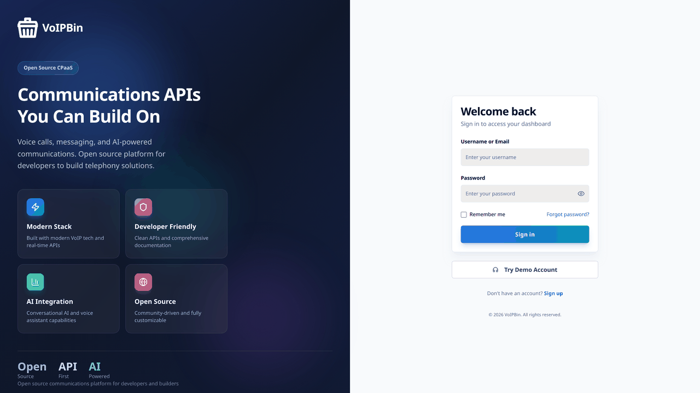
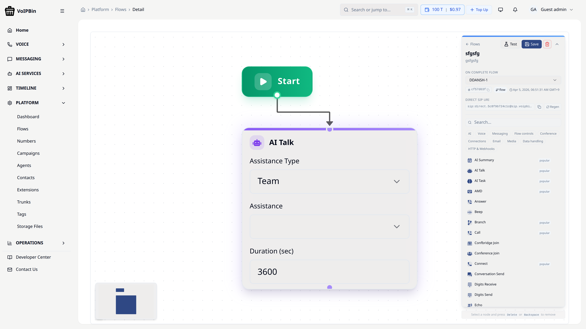
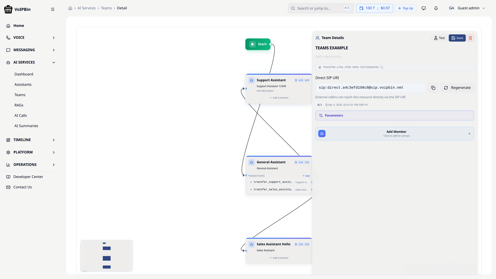
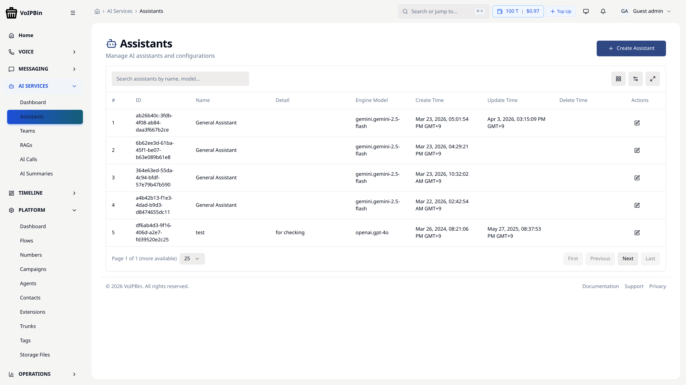

<p align="center">
  <a href="https://voipbin.net">
    
  </a>
</p>

<h1 align="center">VoIPBin</h1>

<h3 align="center">The Open-Source CPaaS Platform</h3>

<p align="center">
Build, deploy, and scale voice, messaging, and video applications — fully self-hosted, API-first, and designed for developers.
</p>

<p align="center">
  <a href="https://voipbin.net">Website</a> •
  <a href="https://api.voipbin.net/docs/">API Docs</a> •
  <a href="https://admin.voipbin.net">Admin Console</a> •
  <a href="https://youtu.be/9VKu_QMFzko">Demo Video</a> •
  <a href="https://github.com/voipbin/voipbin/issues">Community</a>
</p>

<p align="center">
  <a href="https://github.com/voipbin/voipbin/stargazers"></a>
  <a href="https://github.com/voipbin/monorepo/actions"></a>
  <a href="https://github.com/voipbin/voipbin/blob/main/LICENSE"></a>
  <a href="https://github.com/voipbin/monorepo"></a>
  <a href="https://github.com/voipbin/voipbin/issues"></a>
</p>

<br />

<p align="center">
  <a href="https://admin.voipbin.net">
    
  </a>
</p>

---

## Why VoIPBin?

**Most CPaaS platforms come with trade-offs**: vendor lock-in, unpredictable pricing, and zero control over your infrastructure. Most open-source alternatives either stop at SIP or require gluing together a dozen unrelated projects.

**VoIPBin is different.** It's a complete, production-grade CPaaS built from the ground up — 31 microservices running on Kubernetes, with modern programmable APIs, fully open-source and self-hostable.

> _"Own your communications stack."_ — Run your own CPaaS with full API control.

### What makes VoIPBin unique:

- 🏗️ **Production-ready** — Already running live with real traffic at [voipbin.net](https://voipbin.net)
- 🔓 **Truly open-source** — MIT Licensed, no "open-core" bait-and-switch
- 🧩 **Complete platform** — Voice, SMS, Video, AI, Queues, Campaigns — not just a SIP server
- 🤖 **AI-native** — Built-in AI assistants, real-time transcription, and intelligent call flows
- 🏢 **Multi-tenant** — Full customer isolation, billing, and access control out of the box
- ☸️ **Cloud-native** — Kubernetes-first architecture, scales horizontally

---

## ✨ Features

<table>
<tr>
<td width="50%">

### 📞 Voice & Telephony
- **Programmable Call Flows** — Design advanced call logic with branching, loops, and post-call hooks using declarative JSON
- **Call Queues & Agents** — Priority-based routing, ring strategies, agent login/logout
- **Call Recording** — Record, transcribe, and summarize conversations
- **Conferencing** — Secure real-time audio/video with moderation tools
- **Extension Management** — SIP/WebRTC registration and routing

</td>
<td width="50%">

### 💬 Messaging & Channels
- **SMS & Messaging Flows** — Same powerful flow engine for messages
- **Chat & Web Messaging** — Real-time customer-agent communication
- **Email Integration** — Multichannel notification support
- **Webhook & HTTP** — Trigger actions and integrate with external services

</td>
</tr>
<tr>
<td width="50%">

### 🤖 AI & Intelligence
- **AI-Powered Voice Assistants** — Conversational AI with smart action triggers
- **Real-time Transcription** — Live speech-to-text during calls
- **Post-call Summarization** — AI-generated call summaries
- **Intelligent Flow Routing** — Context-aware decision making

</td>
<td width="50%">

### 🏢 Platform & Operations
- **Multitenancy** — Isolated configs, flows, agents per tenant
- **Outbound Campaigns** — Bulk voice/SMS campaigns via API
- **Billing Management** — Built-in usage tracking and billing
- **Number Management** — Phone number provisioning and routing
- **SRTP/OPUS/PCMU/PCMA** — Full codec and media control

</td>
</tr>
</table>

---

## 🎬 See It in Action

<table>
<tr>
<td align="center" width="25%">
  <a href="https://voipbin.net"><b>🌍 Project Site</b></a><br/>
  Landing page
</td>
<td align="center" width="25%">
  <a href="https://admin.voipbin.net"><b>🔧 Admin Console</b></a><br/>
  Try the demo account
</td>
<td align="center" width="25%">
  <a href="https://talk.voipbin.net"><b>📞 Agent App</b></a><br/>
  Web-based agent demo
</td>
<td align="center" width="25%">
  <a href="https://meet.voipbin.net"><b>🎥 Meeting</b></a><br/>
  Video/voice conference
</td>
</tr>
</table>

<table>
<tr>
<td align="center" width="33%">
  <br/>
  <sub>Visual Flow Builder</sub>
</td>
<td align="center" width="33%">
  <br/>
  <sub>Multi-Agent Team Builder</sub>
</td>
<td align="center" width="33%">
  <br/>
  <sub>AI Assistants</sub>
</td>
</tr>
</table>

<p align="center">
  <a href="https://youtu.be/9VKu_QMFzko">
    
  </a>
  <br/>
  <a href="https://youtu.be/9VKu_QMFzko">▶️ Watch the full demo video</a>
</p>

---

## 🚀 Two Ways to Use VoIPBin

VoIPBin offers two deployment options depending on your needs:

<table>
<tr>
<td align="center" width="50%">

### ☁️ VoIPBin Cloud

**The fastest way to get started.**

Use VoIPBin as a fully managed service — no infrastructure to set up, no servers to maintain. Just sign up and start building.

✅ Instant setup — start in minutes<br/>
✅ No infrastructure management<br/>
✅ Auto-scaling & high availability<br/>
✅ Always up-to-date<br/>
✅ Demo account available

<br/>

<a href="https://admin.voipbin.net"><b>🔗 Try VoIPBin Cloud →</b></a>

</td>
<td align="center" width="50%">

### 🏠 Self-Install

**Full control over your infrastructure.**

Deploy VoIPBin on your own cloud infrastructure. Own your data, customize everything, and run it wherever you want.

✅ Complete data ownership<br/>
✅ Currently supports GCP (AWS, Azure planned)<br/>
✅ Full customization & white-labeling<br/>
✅ No usage-based fees<br/>
✅ Air-gapped / private network support

<br/>

<a href="#-self-install-guide"><b>🔗 Self-Install Guide →</b></a>

</td>
</tr>
</table>

---

## ☁️ VoIPBin Cloud — Quick Start

Get started with VoIPBin Cloud in 3 steps:

**1. Sign up at [admin.voipbin.net](https://admin.voipbin.net)**

A demo account is available — no credit card required.

**2. Get your API credentials**

After signing in, grab your API token from the Admin Console dashboard.

**3. Make your first API call**

```bash
# List your registered numbers
curl -X GET https://api.voipbin.net/v1.0/numbers \
  -H "Authorization: Bearer YOUR_API_TOKEN"
```

```bash
# Create a programmable call flow
curl -X POST https://api.voipbin.net/v1.0/flows \
  -H "Authorization: Bearer YOUR_API_TOKEN" \
  -H "Content-Type: application/json" \
  -d '{
    "name": "Hello World",
    "actions": [
      {"type": "talk", "text": "Hello from VoIPBin!"}
    ]
  }'
```

> 📘 **Full API Reference**: [api.voipbin.net/docs](https://api.voipbin.net/docs/) — Explore all endpoints interactively.

---

## 🏠 Self-Install Guide

Deploy VoIPBin on your own cloud with a **single CLI command**. The [**voipbin/install**](https://github.com/voipbin/install) repo handles everything — infrastructure provisioning, VM configuration, and full Kubernetes deployment.

### 3 Commands to Deploy

```bash
# Clone the installer
git clone https://github.com/voipbin/install.git
cd install
pip install -r requirements.txt

# Step 1: Interactive setup wizard (7 questions)
./voipbin-install init

# Step 2: Deploy everything
./voipbin-install apply

# Step 3: Verify deployment health
./voipbin-install verify
```

The `init` wizard guides you through: GCP project, region, cluster type, TLS, domain, and DNS configuration. Then `apply` runs a fully automated 3-stage pipeline:

```
Stage 1: Terraform          Stage 2: Ansible          Stage 3: Kubernetes
─────────────────           ────────────────          ───────────────────
VPC, GKE, Cloud SQL         Kamailio VMs              31 Backend Services
Firewall, DNS, LB           RTPEngine VMs             3 Asterisk Instances
NAT, KMS, Storage           Docker + Config           3 Frontend Apps
                                                      Redis, RabbitMQ, etc.
```

### Prerequisites

| Tool | Version | Install |
|---|---|---|
| **gcloud CLI** | >= 400.0 | [cloud.google.com/sdk](https://cloud.google.com/sdk/docs/install) |
| **Terraform** | >= 1.5.0 | [hashicorp.com](https://developer.hashicorp.com/terraform/downloads) |
| **Ansible** | >= 2.15.0 | `pip install ansible` |
| **kubectl** | >= 1.28.0 | [kubernetes.io](https://kubernetes.io/docs/tasks/tools/) |
| **sops** | >= 3.7.0 | [github.com/getsops](https://github.com/getsops/sops/releases) |
| **Python 3** | >= 3.10 | [python.org](https://www.python.org/downloads/) |

### What Gets Deployed

| Layer | Components |
|---|---|
| **Backend** | 31 Go microservices (call, flow, AI, queue, campaign, billing, etc.) |
| **VoIP** | Asterisk (call, conference, registrar) + Kamailio + RTPEngine |
| **Frontend** | Admin Console, Agent App (talk), Meeting App |
| **Infrastructure** | Redis, RabbitMQ, ClickHouse, Cloud SQL (MySQL), Cloud SQL Proxy |
| **Network** | VPC, Cloud NAT, Load Balancers, Firewall Rules, TLS/SSL |

### Cost Estimates

| Deployment Type | Estimated Cost |
|---|---|
| **Zonal** (testing/small) | ~$170/month |
| **Regional** (production/HA) | ~$243/month |

> **Currently supported:** Google Cloud Platform (GCP)<br/>
> **Planned:** AWS, Azure, and more
>
> 📖 **Full documentation**: See the [**voipbin/install**](https://github.com/voipbin/install) repo for detailed architecture, configuration reference, troubleshooting, and cost breakdowns.

---

## 🏗️ Architecture

VoIPBin is built as a distributed system of **31 Go microservices**, communicating via message queues and REST APIs, all orchestrated on Kubernetes.

```
┌─────────────────────────────────────────────────────────┐
│                     Client Layer                         │
│  Admin Console  •  Agent App  •  Meeting  •  SDK/API    │
└────────────────────────┬────────────────────────────────┘
                         │
┌────────────────────────▼────────────────────────────────┐
│                    API Gateway                           │
│              (bin-api-manager)                           │
└────────────────────────┬────────────────────────────────┘
                         │
┌────────────────────────▼────────────────────────────────┐
│              Core Microservices                          │
│                                                         │
│  ┌──────────┐ ┌──────────┐ ┌──────────┐ ┌──────────┐  │
│  │   Call    │ │   Flow   │ │   AI     │ │  Queue   │  │
│  │ Manager  │ │ Manager  │ │ Manager  │ │ Manager  │  │
│  └──────────┘ └──────────┘ └──────────┘ └──────────┘  │
│                                                         │
│  ┌──────────┐ ┌──────────┐ ┌──────────┐ ┌──────────┐  │
│  │ Campaign │ │Conference│ │ Message  │ │ Customer │  │
│  │ Manager  │ │ Manager  │ │ Manager  │ │ Manager  │  │
│  └──────────┘ └──────────┘ └──────────┘ └──────────┘  │
│                                                         │
│  ┌──────────┐ ┌──────────┐ ┌──────────┐ ┌──────────┐  │
│  │ Billing  │ │  Number  │ │  Agent   │ │  Hook    │  │
│  │ Manager  │ │ Manager  │ │ Manager  │ │ Manager  │  │
│  └──────────┘ └──────────┘ └──────────┘ └──────────┘  │
│                                                         │
│         ... and 19 more microservices                  │
└────────────────────────┬────────────────────────────────┘
                         │
┌────────────────────────▼────────────────────────────────┐
│                 Media & VoIP Layer                       │
│       Asterisk  •  Kamailio  •  RTPEngine               │
└─────────────────────────────────────────────────────────┘
```

> 📖 See the full [architecture documentation](https://github.com/voipbin/monorepo) for detailed service descriptions.

---

## 📦 Repositories

| Repository | Description | Stars |
|---|---|---|
| **[voipbin/voipbin](https://github.com/voipbin/voipbin)** | 📍 You are here — project overview and documentation |  |
| **[voipbin/install](https://github.com/voipbin/install)** | Self-install guide and deployment scripts |  |
| **[voipbin/monorepo](https://github.com/voipbin/monorepo)** | Backend microservices (31 Go services) |  |
| **[voipbin/voipbin-go](https://github.com/voipbin/voipbin-go)** | Go SDK for VoIPBin API |  |
| **[voipbin/mcp](https://github.com/voipbin/mcp)** | MCP (Model Context Protocol) server |  |
| **[voipbin/sandbox](https://github.com/voipbin/sandbox)** | Sandbox & examples |  |

---

## 📚 Documentation

- 📘 **[API Reference](https://api.voipbin.net/docs/)** — Explore and test all VoIPBin APIs
- 🏗️ **[Architecture Guide](https://github.com/voipbin/monorepo)** — System design and service breakdown
- 🐍 **[Python Examples](https://github.com/voipbin/sandbox)** — Sample applications and integrations

---

## 🗺️ Roadmap

- [x] Programmable voice flows with JSON-based logic
- [x] SMS & messaging flow engine
- [x] AI-powered voice assistants
- [x] Real-time transcription & summarization
- [x] Multi-tenant platform with billing
- [x] Outbound campaign engine
- [x] Video conferencing (WebRTC)
- [x] MCP server for AI agent integration
- [x] Terraform-based cloud deployment (GCP)
- [ ] Docker Compose quick-start for easy local setup
- [ ] AWS & Azure support
- [ ] Plugin/extension marketplace
- [ ] SDKs for Python, JavaScript, Java
- [ ] Hosted free tier at voipbin.net

> 💡 Have an idea? [Open an issue](https://github.com/voipbin/voipbin/issues) — we'd love to hear from you!

---

## 🤝 Contributing

We welcome contributions of all kinds! Whether it's fixing a bug, improving documentation, or proposing new features.

```bash
# Fork and clone
git clone https://github.com/YOUR_USERNAME/monorepo.git

# Create a feature branch
git checkout -b feature/amazing-feature

# Make your changes and submit a PR
```

See the [monorepo](https://github.com/voipbin/monorepo) for development setup instructions.

---

## 📫 Contact

- 🌐 Website: [voipbin.net](https://voipbin.net)
- 📧 Email: [sungtae@voipbin.net](mailto:sungtae@voipbin.net)
- 🐙 GitHub: [@voipbin](https://github.com/voipbin)

---

## ⭐ Star History

If you find VoIPBin useful, please consider giving us a star! It helps others discover the project.

<p align="center">
  <a href="https://star-history.com/#voipbin/voipbin&Date">
    <picture>
      <source media="(prefers-color-scheme: dark)" srcset="https://api.star-history.com/svg?repos=voipbin/voipbin&type=Date&theme=dark" />
      <source media="(prefers-color-scheme: light)" srcset="https://api.star-history.com/svg?repos=voipbin/voipbin&type=Date" />
      
    </picture>
  </a>
</p>

---

## 📄 License

VoIPBin is open-source software licensed under the [MIT License](LICENSE).

<p align="center">
  <sub>Built with ❤️ by <a href="https://github.com/pchero">@pchero</a> — CPaaS for All</sub>
</p>
