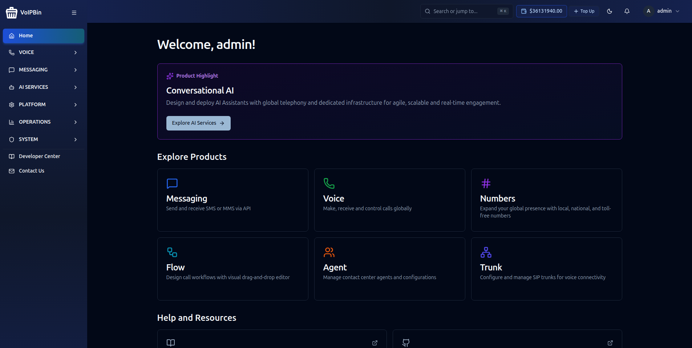

# VoIPBin Install (Docker Compose)

```
          ████████          
   ██████████████████████    __     __   ___ ____  ____  _
  ██                    ██   \ \   / /__|_ _|  _ \| __ )(_)_ __
 ██████████████████████████   \ \ / / _ \| || |_) |  _ \| | '_ \
 ██                      ██    \ V / (_) | ||  __/| |_) | | | | |
  ██    ██   ██   ██    ██      \_/ \___/___|_|   |____/|_|_| |_|
  ██    ██   ██   ██    ██          Connect & Collaborate for all
  ██    ██   ██   ██    ██              S E L F - I N S T A L L
  ██    ██   ██   ██    ██  
   ██   ██   ██   ██   ██   
   ██████████████████████   
```

**Your Private AI-Powered CPaaS Laboratory** — A complete Docker Compose environment for building AI voice agents and communications applications. Deploy 25+ microservices with built-in AI capabilities: real-time speech-to-text, text-to-speech, LLM-powered conversations, and programmable voice workflows.

### Why VoIPBin Install?

- **AI Voice Agents** — Build conversational AI agents with OpenAI, Deepgram, ElevenLabs, and Cartesia
- **Real-time Transcription** — Live speech-to-text during calls with AWS Transcribe or Google Speech
- **Text-to-Speech** — Natural voice synthesis with multiple provider support
- **Programmable Voice** — Visual flow builder for IVR, call routing, and automation
- **Full VoIP Stack** — Production-grade SIP proxy, media servers, and conferencing
- **Web Applications** — Admin console, agent team messenger (Talk), and voice conferencing (Meet)

---

## Table of Contents

- [Quick Start](#quick-start)
- [Migrating from voipbin/sandbox](#migrating-from-voipbinsandbox)
- [Install Modes](#install-modes)
- [External Mode (Real Domain)](#external-mode-real-domain)
  - [Hosting-provider routed IPs](#hosting-provider-routed-ips)
- [Web Applications](#web-applications)
- [Technical Architecture](#technical-architecture)
- [Prerequisites](#prerequisites)
- [Networking & DNS](#networking--dns)
- [SSL Certificate Trust](#ssl-certificate-trust)
- [The Interactive CLI](#the-interactive-cli)
- [AI Voice Agents](#ai-voice-agents)
- [Developer's Playground](#developers-playground)
- [Service Reference](#service-reference)
- [Troubleshooting](#troubleshooting)

---

## Quick Start

```bash
# Clone the repository
git clone https://github.com/voipbin/voipbin.git
cd voipbin/install
```

### First-Time Install (unprivileged, AI-agent friendly)

This is the recommended path for a fresh install, since it isolates the one
step that actually needs root (`setup-host.sh`):

```bash
./scripts/init.sh --yes          # 1. Generate .env, certificates, docker-compose.yml
sudo ./scripts/setup-host.sh     # 2. The single sudo command (host mutations)
./scripts/start.sh               # 3. Start all 25+ services
./scripts/check-install.sh       # 4. Self-verify the install
```

`docker-compose.yml` is copied from the committed `docker-compose.yml.dist`
the first time `init.sh` runs, then left alone (untracked, `install/.gitignore`)
for the life of the install — a later `git pull` in this repo updates
`docker-compose.yml.dist` but never touches your live `docker-compose.yml`.
To adopt upstream changes (new services, image digest bumps), diff the two
files and merge deliberately, or run `scripts/sync-compose-images.sh` with
`COMPOSE_FILE=docker-compose.yml` to pull in just the image digest updates.

**Upgrading an install that predates this split:** before this change,
`docker-compose.yml` was a normal git-tracked file. The first `git pull`
that brings in `docker-compose.yml.dist` turns that path into an ordinary
git rename — your tracked `docker-compose.yml` is deleted from the working
tree with no warning or conflict, and `docker-compose.yml.dist` appears in
its place. `docker compose` commands fail ("no configuration file
provided") until you recover it. **Do not just re-run `init.sh`** — it will
copy whatever `docker-compose.yml.dist` is at the current commit, which may
not match what you were actually running. Instead, before or immediately
after that `git pull`, recover your actual pre-pull file:
```bash
git log --all --oneline --diff-filter=D -- docker-compose.yml
# ^ finds the commit that DELETED it (the split commit, e.g. this pull).
# The file lived in that commit's PARENT - use <commit>^, not the commit
# itself (`git show <commit>:docker-compose.yml` fails with "exists on
# disk, but not in '<commit>'" - it was already gone there).
git show <that commit>^:docker-compose.yml > docker-compose.yml
```
`init.sh` also detects this case itself (an existing `.env` plus a missing
`docker-compose.yml`) and prints this same recovery guidance rather than
silently copying `.dist` — but doing the recovery proactively, before
running any other command, is safer than relying on that reminder.

See [Install Modes](#install-modes) for `external` mode (a real domain
instead of `voipbin.test`).

### Day-to-Day Operations: the `voipbin` CLI

Once installed, `sudo ./voipbin` is the interactive command center for
day-to-day operations: status, logs, restart, debug shells (`ast`, `kam`,
`db`, `api`), backup/restore, and version pinning/rollback (see
[The Interactive CLI](#the-interactive-cli)). It wraps the same
`scripts/*.sh` entry points used above.

```bash
sudo ./voipbin
```

This launches the **interactive CLI**. From there:

```
voipbin> status
voipbin> logs -f api-manager
```

Or run commands directly:

```bash
sudo ./voipbin status
sudo ./voipbin restart api-manager
```

**Note:** `sudo ./voipbin init` / `sudo ./voipbin start` also work (the CLI
wraps `scripts/init.sh` / `scripts/start.sh`), but run the whole flow as
root. The unprivileged 4-command flow above is recommended for the first
install; use the `voipbin` CLI afterward for routine operations.

The `start` command (either path) handles **everything** after initialization:

1. Generates `.env` with auto-detected network settings
2. Creates SSL certificates (browser-trusted if mkcert installed)
3. Starts infrastructure (MySQL, Redis, RabbitMQ, CoreDNS)
4. Runs database migrations
5. Configures DNS resolution for `*.voipbin.test`
6. Sets up VoIP network interfaces
7. Starts all 25+ microservices
8. Creates test account and extensions (opt-in, off by default — see below)

### What Gets Created

Test account seeding only runs when `VOIPBIN_SANDBOX_DEV_SEED=true` is set (off by
default). When enabled, `start` creates:

| Resource | Value |
|----------|-------|
| **Admin Account** | `admin@localhost` / `admin@localhost` |
| **Extension 1000** | Password: `pass1000` |
| **Extension 2000** | Password: `pass2000` |
| **Extension 3000** | Password: `pass3000` |
| **Initial Balance** | $100,000.00 |

### Interactive Shell Features

The CLI provides a powerful interactive environment:

- **Tab Completion** — Auto-complete commands and service names
- **Command History** — Use arrow keys to navigate previous commands
- **Context Modes** — Enter `ast`, `kam`, `db`, or `api` for specialized shells

```
voipbin> ast                        # Enter Asterisk context
voipbin(asterisk)> pjsip show endpoints
voipbin(asterisk)> exit             # Return to main shell

voipbin> api                        # Enter API context
voipbin(api)> login admin@localhost
voipbin(api)> get /v1.0/extensions
```

---

## Migrating from voipbin/sandbox

If you have an existing `voipbin/sandbox` checkout that is already running
(a live install with real data: customers, extensions, call history), do
**not** just clone this repo and re-run `init.sh` in the new location. That
will generate a brand-new `.env` with fresh random credentials and, unless
you take the steps below, a different Docker Compose project name, which
changes the derived volume and network names Docker uses to find your
existing data.

### Why the project name matters

`scripts/common.sh`'s `derive_compose_project_name()` (shared by
`setup-host.sh`, `start.sh`, `doctor.sh`, and `setup-voip-network.sh`) picks
the Compose project name in this order:

1. the `COMPOSE_PROJECT_NAME` **shell environment variable**, if exported
2. otherwise, the checkout directory's basename (lowercased, sanitized)

This mirrors `docker compose`'s own resolution order, which also honors an
exported `COMPOSE_PROJECT_NAME` shell variable. **Neither of these reads
`COMPOSE_PROJECT_NAME` out of `.env`**, only an actual shell export
affects them. A checkout at `voipbin/sandbox/` implicitly used the project
name `sandbox`; Docker volumes (`sandbox_db_data`, etc.) and networks
(`sandbox_default`) are named from it. A fresh checkout at
`voipbin/install/` would default to the project name `install`
instead, and every script would look for (or create) `install_*`
volumes and networks, leaving your `sandbox_*` volumes untouched and
seemingly "gone," even though the data is still on disk.

**Fix: export `COMPOSE_PROJECT_NAME=sandbox` in your shell** (not just in
`.env`, since these scripts do not read it from there) before running anything
in the new checkout:

```bash
export COMPOSE_PROJECT_NAME=sandbox
```

Put this in your shell profile or re-export it in every session you run
`scripts/*.sh` or `docker compose` from, until you deliberately decide to
rename the project (which would require a one-time volume/network migration
of its own).

### Steps

1. **Clone the new repo** alongside (not on top of) your old checkout:

   ```bash
   git clone https://github.com/voipbin/voipbin.git
   ```

2. **Copy your existing state into `voipbin/install/` before running
   any script:**

   ```bash
   cp /path/to/old/sandbox/.env voipbin/install/.env
   cp -r /path/to/old/sandbox/certs voipbin/install/certs
   # If present in the old checkout:
   cp /path/to/old/sandbox/config/dummy-gcp-credentials.json voipbin/install/config/ 2>/dev/null || true
   cp /path/to/old/sandbox/.test_data_initialized voipbin/install/ 2>/dev/null || true
   ```

3. **Export `COMPOSE_PROJECT_NAME=sandbox`** in the shell you'll run the
   scripts from (see above).

4. **Do NOT run `./scripts/init.sh --yes`** on the copied `.env`. Reading
   `init.sh`'s `check_existing_env_compat()`: when the requested mode/domain
   match what's already in `.env`, `--yes` silently overwrites it, including
   regenerating `JWT_KEY`, `MYSQL_ROOT_PASSWORD`, `RABBITMQ_DEFAULT_PASS`,
   `DATABASE_ASTERISK_PASSWORD`, and `POSTGRES_PASSWORD` with brand-new
   random values (`AMI_PASSWORD` is the one exception since VOIP-1329 — it's
   always the fixed `asterisk`, never regenerated). Those new values will
   not match the credentials already baked into your existing database and
   RabbitMQ Docker volumes, so your services will fail to authenticate
   against your own (otherwise intact) data. There is no dedicated flag to
   skip credential rotation while still touching `.env`, so the correct
   move is to skip `init.sh` entirely once `.env` has been copied over.

5. **Skip straight to host setup, start, and verify:**

   ```bash
   sudo ./scripts/setup-host.sh
   ./scripts/start.sh
   ./scripts/check-install.sh
   ```

   `setup-host.sh` and `start.sh` are idempotent and probe existing state
   (mkcert CA, DNS, the Docker network, VoIP interfaces), so they will not
   duplicate work already done by your old checkout, as long as
   `COMPOSE_PROJECT_NAME` resolves to the same value (`sandbox`) it always
   did.

6. Run `./scripts/doctor.sh` if anything looks off (it is read-only and
   diagnoses install state at any stage, printing the exact recovery
   command for each failure).

Once you've confirmed the migrated checkout is healthy, you can retire the
old `voipbin/sandbox` directory (after your own backup of `.env`, `certs/`,
and volumes, per your own risk tolerance).

---

## Install Modes

The sandbox installs in one of two modes, chosen at init time and recorded
in `.env` as `DOMAIN_MODE`:

| | Internal mode (default) | External mode |
|---|---|---|
| Base domain | `voipbin.test` (IANA reserved TLD, RFC 2606) | Your real domain (e.g. `example.com`) |
| DNS | Automatic. CoreDNS container plus `/etc/resolv.conf` forwarding | Operator-managed A records at your DNS provider |
| TLS | Automatic. mkcert (browser-trusted) or self-signed | Bring your own certificate (Let's Encrypt recipe below) |
| Reachable from | This machine and your LAN | Any host that can route to your IPs |
| Best for | Local development, demos, evaluation | A sandbox shared under a real domain |

**Decision guidance:** use internal mode unless you specifically need the
sandbox reachable under a real domain from machines you do not control.
Internal mode requires nothing from you (no domain, no certificate, no DNS
provider) and stays byte-for-byte the behavior this sandbox always had.
External mode is for directly-routable hosts (on-prem, corporate LAN with
internal DNS, cloud with multiple routable IPs); see the prerequisites in
the next section.

**Mode selection is an init-time decision.** Extension SIP realms embed the
base domain in the database, so `init.sh` refuses to switch mode or domain
on an existing install. See
[Changing mode or domain later](#changing-mode-or-domain-later) for the two
supported escape hatches.

### Unprivileged install flow (both modes)

Besides the classic `sudo ./voipbin` flow, the sandbox supports a
4-command unprivileged flow with exactly one sudo command, designed so an
AI agent (or a human without standing root) can drive the install:

```bash
./scripts/init.sh --yes          # 1. Generate .env, certificates, docker-compose.yml (unprivileged)
sudo ./scripts/setup-host.sh     # 2. The single sudo command (host mutations)
./scripts/start.sh               # 3. Start all services (unprivileged)
./scripts/check-install.sh       # 4. Self-verify the install (unprivileged)
```

Every entry-point script ends with a machine-parseable result line
(`VOIPBIN_INIT:`, `VOIPBIN_SETUP_HOST:`, `VOIPBIN_START:`,
`VOIPBIN_CHECK:`, `VOIPBIN_CERTS:`, `VOIPBIN_DOCTOR:`). The full contract
is documented in [CLAUDE.md](CLAUDE.md).

If any step fails, `./scripts/doctor.sh` is the recovery entry point: a
read-only diagnostic that works at any stage (before init, mid-install,
or against a running stack) and prints a `FIX <name>: <command>` line
with the exact remedy for every failure it finds.

---

## External Mode (Real Domain)

External mode runs the sandbox under a real domain with a real certificate.
The sandbox never touches DNS or the trust store in this mode; you own both.

### Prerequisites

- **A directly-routable host.** The sandbox binds two distinct IP addresses
  on the same subnet: `HOST_EXTERNAL_IP` (web/API) and
  `KAMAILIO_EXTERNAL_IP` (SIP signaling, a macvlan secondary address), plus
  `RTPENGINE_EXTERNAL_IP` for media. The deployment environment must route
  all of them. Supported targets: on-prem servers, corporate LANs with
  internal DNS, cloud environments with multiple routable IPs.
- **Known limitation:** single-public-IP NAT environments (a typical cloud
  VM) are not supported this cycle. Kamailio runs with host networking and
  binds its dedicated address directly, so there is no port mapping to
  remap behind a NAT. This is tracked as a follow-up.
- **A real domain** you control at a DNS provider.
- **A certificate** covering the required names (a wildcard is the easy
  path; see the recipe below).

### Step 1: Create DNS records

Create these records at your DNS provider (replace `example.com` with your
domain, and the targets with your actual IPs):

| Record | Type | Target | Purpose |
|---|---|---|---|
| `api.example.com` | A | Host IP | REST API + WebSocket (:8443) |
| `admin.example.com` | A | Host IP | Admin Console (:3003) |
| `meet.example.com` | A | Host IP | Meet (:3004) |
| `talk.example.com` | A | Host IP | Talk (:3005) |
| `sip.example.com` | A | Kamailio external IP | SIP signaling / WSS (:5060/:5066) |
| `sip-service.example.com` | A | Kamailio external IP | SIP surface |
| `conference.example.com` | A | Kamailio external IP | SIP surface |
| `trunk.example.com` | A | Kamailio external IP | SIP trunking |
| `pstn.example.com` | A | Kamailio external IP | PSTN gateway |
| `registrar.example.com` | A | Kamailio external IP | Apex registrar name. Passed to the web clients as `REGISTRAR_DOMAIN` and **not** covered by the wildcard below |
| `*.registrar.example.com` | A | Kamailio external IP | Per-customer SIP realm resolution (devices resolving the realm domain directly) |

TTL guidance: a short TTL (300s or less) while setting up makes mistakes
cheap to fix; raise it once `check-install.sh` passes.

Remember that Host IP and Kamailio IP are **two different addresses**. The
`voipbin dns` CLI subcommands print this exact table with your configured
domain and IPs substituted.

> **Warning: the web UIs are plain HTTP.** The `admin`/`meet`/`talk` UIs
> are served over cleartext HTTP on ports 3003 to 3005 in both modes. On a
> routable domain this means login credentials and JWTs travel in the
> clear. Front them with a TLS-terminating reverse proxy (nginx, Caddy,
> Traefik) or restrict those ports to trusted networks — or use
> `--web-reverse-proxy` below, which sets up exactly that with the sandbox's
> own certificate and no port suffixes at all.

### Step 2: Obtain a certificate (Let's Encrypt recipe)

The sandbox installs whatever certificate you bring (`--tls byo`). The
certificate must cover `api.`, `sip.`, `sip-service.`, `conference.`,
`trunk.`, and `registrar.` of your domain; a wildcard covers all six.
`*.registrar.example.com` is additionally recommended for SIP devices that
resolve the realm domain directly.

A wildcard requires the DNS-01 challenge (HTTP-01 cannot issue wildcards):

```bash
certbot certonly --preferred-challenges dns --manual \
  -d example.com -d '*.example.com' -d '*.registrar.example.com'
```

DNS-provider certbot plugins (for example `certbot-dns-cloudflare` and
friends) make this non-interactive; the `--manual` form asks you to create
TXT records by hand.

### Step 3: Initialize (unprivileged)

```bash
./scripts/init.sh --mode external --domain example.com --tls byo \
  --cert /etc/letsencrypt/live/example.com/fullchain.pem \
  --key  /etc/letsencrypt/live/example.com/privkey.pem \
  --yes
```

The certificate is validated (key match, SAN coverage, expiry) before
`.env` is written; a bad certificate aborts cleanly. In external mode init
generates no Corefile and no self-signed certificates.

### Step 4: Host setup (the single sudo command)

```bash
sudo ./scripts/setup-host.sh
```

In external mode this only ensures the compose docker network exists
(fresh hosts have none until the first `docker compose up`) and creates
the VoIP network interfaces (internal veth pairs + external macvlan, see
"Internal Interfaces" in `install/CLAUDE.md`). mkcert and DNS steps are
skipped; TLS and DNS are operator-managed.

### Step 5: Start and verify (unprivileged)

```bash
./scripts/start.sh
./scripts/check-install.sh
```

`check-install.sh` verifies service counts, the TLS chain (strictly
without `-k`), DNS resolution against the system resolver, API liveness,
realm configuration, and that resolv.conf was left untouched. It prints
one `CHECK` line per check and a final `VOIPBIN_CHECK:` result line, and
exits 0 only when everything passes.

### Certificate renewal

`install-certs.sh` is idempotent and usable as a certbot deploy hook, so
renewal reinstalls the certificate and recreates the consuming services
automatically:

```bash
certbot renew --deploy-hook \
  '/path/to/sandbox/scripts/install-certs.sh /etc/letsencrypt/live/example.com/fullchain.pem /etc/letsencrypt/live/example.com/privkey.pem'
```

The deploy hook runs as root; the script preserves the ownership and mode
of `.env` and everything under `certs/`, so later unprivileged runs do not
hit root-owned files.

### Web reverse proxy (port-less URLs, VOIP-1325)

By default, external mode's `api`/`admin`/`meet`/`talk` are reached at
`https://api.example.com:8443`, `http://admin.example.com:3003`, and so
on — the individual published host ports from the table in
[DNS Resolution](CLAUDE.md#dns-resolution). That is fine behind an
operator-owned proxy, but the wrong shape when the sandbox is meant to be
the origin customers hit directly with a clean, port-less URL and TLS
everywhere (including `admin`/`meet`/`talk`, closing the plain-HTTP warning
above).

`init.sh --web-reverse-proxy` runs a Caddy container in front of the
stack, terminating TLS with the same BYO certificate and routing by Host
header to the right internal service — so `https://admin.example.com`
(no `:3003`) just works:

```bash
./scripts/init.sh --mode external --domain example.com --tls byo \
  --cert fullchain.pem --key privkey.pem \
  --web-reverse-proxy --yes
sudo ./scripts/setup-host.sh
./scripts/start.sh
./scripts/check-install.sh
```

Requirements and notes:

- **External mode + `--tls byo` only.** `init.sh` rejects the flag
  otherwise — internal mode's mkcert/self-signed certificates only ever
  cover the individual port-suffixed URLs this flag exists to replace.
- **Certificate must additionally cover `admin`/`meet`/`talk`.** The
  Step 2 wildcard recipe already satisfies this (`*.example.com` covers
  every subdomain); a non-wildcard certificate needs those three names
  added explicitly, or `install-certs.sh` refuses it with the missing
  names listed.
- **DNS is unaffected.** `admin`/`meet`/`talk` still resolve to the host
  IP exactly as in the table in Step 1 — Caddy listens on the standard
  80/443 on that same host, it does not introduce a new address.
- Enabled via `.env`'s `WEB_REVERSE_PROXY=true` and
  `COMPOSE_PROFILES=web-proxy` (both written by `init.sh`, same pattern as
  internal mode's `internal-dns` profile for CoreDNS). The Caddyfile is
  generated by `setup-host.sh` at `config/caddy/Caddyfile` and is
  regenerated only when `setup-host.sh` reruns (it depends on
  `BASE_DOMAIN`, not on any IP, so it never needs an IP-change refresh the
  way the CoreDNS Corefile does).
- `sip`/`pstn`/other SIP-surface domains are untouched — Caddy only ever
  proxies the four web-facing names.
- **`admin`/`meet`/`talk`'s published `:3003`/`:3004`/`:3005` become
  loopback-only** (`SQUARE_BIND_ADDR=127.0.0.1` in `.env`, set by `init.sh`).
  Caddy's own `80`/`443` publish is the only externally-reachable path to
  them once the flag is active — this is intentional (it closes the
  cleartext-credential exposure the plain-HTTP warning above describes),
  but it means `http://admin.example.com:3003` stops working from
  anywhere except the host itself.
- **`API_URL`/`WEBSOCKET_URL`/the email-verification base URL in `.env`
  drop the `:8443` suffix.** Without this, the admin/meet/talk pages would
  load port-less while every request they issue still targeted `:8443` —
  defeating the point of the flag. `EMAIL_VERIFY_BASE_URL` follows the
  same rule.
- **A later `init.sh` re-run must restate `--web-reverse-proxy`.**
  `init.sh` refuses to rewrite `.env` (same-mode `--yes` overwrite or
  `--force-reinit`) without it, since silently dropping it would disable
  Caddy on the next `start.sh` with no error at any step. There is
  currently no `--no-web-reverse-proxy` to turn it back off on an existing
  install; do that by hand-editing `WEB_REVERSE_PROXY=false` and
  `COMPOSE_PROFILES=` in `.env`, or via `clean.sh --volumes --purge` and a
  fresh init (destroys the database).

### Changing mode or domain later

The base domain is baked into database state (extension SIP realms are
`{customer_id}.registrar.<domain>`), so `init.sh` refuses a mode or domain
switch on an existing install. Two supported escape hatches:

1. **Full reset** (demo installs): `./scripts/clean.sh --volumes --purge`
   then re-run init. Always use the combined form; `--purge` alone keeps
   the database volume with the old-domain realms, which is the worst
   state.
2. **`init.sh --force-reinit`**: rewrites `.env`, certificates and (in
   internal mode) the Corefile for the new domain without touching the
   database, then prints the exact follow-up needed for live state: delete
   and recreate extensions via the API (or `setup_test_customer.sh` for
   the test customer) and recreate the `registrar-manager`, `api-manager`,
   `hook-manager`, `customer-manager` and `square-*` containers. Without
   an explicit `--mode`, `--force-reinit` is refused when it would silently
   target a different mode or domain than the existing install. Switching
   from internal to external additionally requires a clean host first
   (stack down under the old `.env`, then
   `sudo ./scripts/setup-dns.sh --uninstall`); the flag refuses and prints
   the exact commands while any internal-mode host state remains.

### Hosting-provider routed IPs

By default `init.sh` derives `KAMAILIO_EXTERNAL_IP`/`RTPENGINE_EXTERNAL_IP`
as `HOST_EXTERNAL_IP` + a fixed offset, on the assumption that nearby
addresses in the host's own subnet are free for you to use (true on a home
LAN or a cloud VM with a private subnet you control). **This does not hold
on most dedicated-server hosts**, where additional IPs are individually
allocated — often from a different subnet than your primary IP entirely,
each with its own gateway, and requiring the provider to bind the address
to a specific MAC before any traffic reaches it. Using the auto-generated
offset in that environment picks an address you don't own; it will not
work and may create ARP conflicts on the provider's network.

Pass the IPs the provider actually assigned you explicitly:

```bash
./scripts/init.sh --mode external --domain example.com --tls byo \
  --cert fullchain.pem --key privkey.pem \
  --kamailio-ip <provider-assigned-ip-1> \
  --rtpengine-ip <provider-assigned-ip-2> \
  --yes
```

Both flags are required together. This writes `EXTERNAL_IP_PINNED=true` to
`.env`, which stops `common.sh`'s host-IP-change handling from ever
recalculating these two addresses — they came from the provider's
allocation, not from your host IP, so nothing about a host IP change
should touch them. `setup-voip-network.sh` also skips its normal `ip addr
add` for pinned IPs, on the assumption the routing below is already wired
by the time you run it (order matters: wire the network first, then
`setup-host.sh`/`start.sh`).

**What "wired" means is provider-specific** — this project cannot automate
it in general. What worked against a ReliableSite dedicated server (their
model: each additional IP has its own gateway, and must be bound to a
specific MAC address via their control panel before traffic is delivered):

1. Create a macvlan sub-interface per pinned IP, off your primary NIC:
   `ip link add kamailio-ext link <primary-nic> type macvlan mode bridge`.
   This gets its own auto-generated MAC address.
2. Register that MAC against the provider-assigned IP in the provider's
   control panel (their "custom MAC" option, however it's exposed).
3. Address the interface with the **full netmask and gateway the provider
   assigned to that specific IP** — not `/32`, and not your primary
   interface's gateway. These frequently differ per IP even when the IPs
   look unrelated to your primary subnet.
4. Since each pinned IP's gateway differs, add source-based policy routing
   so return traffic exits via the right gateway:
   `ip rule add from <ip> table <N>` +
   `ip route add default via <its-gateway> dev <its-interface> table <N>`.
5. Make all of the above persistent (survives reboot) via your distro's
   network manager — e.g. systemd-networkd `.netdev`/`.network` units, one
   pair per pinned interface, plus a `[RoutingPolicyRule]` block for step 4.

**Known gap:** `setup-host.sh` also creates the two *internal* interfaces
(`kamailio-int`/`rtpengine-int`, veth pairs enslaved to the Docker bridge —
VOIP-1331, not macvlan; see `install/CLAUDE.md` "Internal Interfaces") via
plain `ip link add` — those are not made persistent by the script either,
on either code path. A reboot removes them, and Kamailio/RTPEngine (both
`network_mode: host`) then fail to bind and crash-loop until you re-run
`sudo ./scripts/setup-host.sh` (idempotent — safe to re-run any time).
Until this is fixed upstream, a systemd oneshot unit that runs
`setup-host.sh` after `docker.service` on every boot is a reasonable
operator-side workaround.

**Also verify your host firewall (if any) explicitly.** This project does
not configure one. Two firewall mistakes are easy to make together with
routed IPs and worth checking for directly: (1) a default-deny `forward`
chain blocks Docker's own container-to-internet NAT unless you explicitly
allow traffic to/from the Docker bridge interfaces (`docker0`, `br-*`) —
without it, image pulls and any outbound call from a container fail; (2) a
blanket bridge-allow rule added for that reason can just as easily expose
Docker-published database/broker ports (MySQL 3306, Redis 6379, RabbitMQ
5672/15672) to the entire internet, since they reach containers via the
same `forward` path — block those specific ports explicitly, before the
bridge-allow rule, regardless of source.

---

## Web Applications

VoIPBin Install includes three web applications for managing and using the platform.

### Admin Console

**URL:** http://admin.voipbin.test:3003



The Admin Console is your central management hub:
- Manage customers, extensions, and agents
- Visual flow builder for IVR and call routing
- Real-time call monitoring and analytics
- Billing and usage tracking

### Talk (Agent Team Messenger)

**URL:** http://talk.voipbin.test:3005


Talk is a team collaboration platform for agents:
- Real-time messaging and team chat
- Integrated voice calling with WebRTC
- Agent presence and availability status
- Call history and conversation tracking

### Meet (Voice Conferencing)

**URL:** http://meet.voipbin.test:3004


Meet provides simple voice conferencing:
- Join audio conference rooms via browser
- WebRTC-powered for easy access
- Dial-in via SIP supported

**Default Credentials:** `admin@localhost` / `admin@localhost` (requires opt-in test-account seeding via `VOIPBIN_SANDBOX_DEV_SEED=true`)

---

## Technical Architecture

VoIPBin Install orchestrates a microservices architecture with four core layers:

| Layer | Components | Purpose |
|-------|------------|---------|
| **AI Engine** | Pipecat, AI Manager, Transcribe, TTS | Voice AI agents, real-time STT/TTS, LLM integration |
| **SIP Edge** | Kamailio, RTPEngine | SIP signaling proxy, RTP media relay, NAT traversal |
| **Media Servers** | Asterisk (Call, Registrar, Conference) | Call handling, SIP registration, conferencing |
| **API & Managers** | 20+ backend services | REST API, call routing, billing, workflows |

### Technology Stack

| Category | Technology |
|----------|------------|
| **AI/LLM** | OpenAI GPT, Pipecat Framework |
| **Speech-to-Text** | Deepgram, AWS Transcribe, Google Speech |
| **Text-to-Speech** | ElevenLabs, Cartesia, AWS Polly |
| SIP Proxy | Kamailio 5.x |
| Media Server | Asterisk 20.x |
| RTP Proxy | RTPEngine |
| Database | MySQL 8.0 |
| Message Queue | RabbitMQ 3.x |
| Cache | Redis |
| Frontend | React (Admin, Talk, Meet) |

### Network Topology

```
                    ┌─────────────────────────────────────────┐
                    │           External Network              │
                    │  HOST_IP:8443 (API)  KAMAILIO_IP:5060   │
                    └────────────┬───────────────┬────────────┘
                                 │               │
                    ┌────────────▼───────────────▼────────────┐
                    │         Docker Host (Linux/macOS)       │
                    │  ┌─────────────────────────────────────┐│
                    │  │   CoreDNS (*.voipbin.test → IPs)    ││
                    │  └─────────────────────────────────────┘│
                    │                                         │
                    │  ┌──────────┐  ┌──────────┐  ┌────────┐ │
                    │  │ Kamailio │  │RTPEngine │  │  API   │ │
                    │  │ (host)   │  │  (host)  │  │Manager │ │
                    │  └────┬─────┘  └────┬─────┘  └────────┘ │
                    │       │             │                   │
                    │  ┌────▼─────────────▼────────────────┐  │
                    │  │     Docker Network (10.100.0.0/16)│  │
                    │  │  ┌─────────┐ ┌─────────┐ ┌──────┐ │  │
                    │  │  │Asterisk │ │Asterisk │ │ 20+  │ │  │
                    │  │  │  Call   │ │Registrar│ │Mgrs  │ │  │
                    │  │  └─────────┘ └─────────┘ └──────┘ │  │
                    │  └───────────────────────────────────┘  │
                    └─────────────────────────────────────────┘
```

---

## Prerequisites

### Ubuntu/Debian

```bash
# Docker & Docker Compose
sudo apt update && sudo apt install -y docker.io docker-compose-v2
sudo usermod -aG docker $USER && newgrp docker

# Docker Compose v2.24.4+ is recommended (developer test overrides use
# `!reset`/`!override` merge tags). Check with: docker compose version

# Database migrations run inside a container (scripts/migrate.sh) -
# no host alembic/mysqlclient installation is needed.

# mkcert (for browser-trusted SSL certificates)
sudo apt install -y mkcert
mkcert -install
```

### macOS

```bash
# Docker Desktop
brew install --cask docker

# Database migrations run inside a container - no host Python deps needed.

# mkcert
brew install mkcert
mkcert -install
```

> **Note:** The `mkcert -install` command adds a local Certificate Authority to your system trust store. This allows locally-generated certificates to be trusted by your browser without security warnings.

---

> **🔒 Security: credentials are generated per-install, not shipped as defaults**
>
> | Service | Credentials |
> |---------|-------------|
> | MySQL | Randomly generated per install, in `.env` (`MYSQL_ROOT_PASSWORD`) |
> | RabbitMQ | Randomly generated per install, in `.env` (`RABBITMQ_DEFAULT_USER` / `RABBITMQ_DEFAULT_PASS`) |
> | Admin Account (opt-in, `VOIPBIN_SANDBOX_DEV_SEED=true`) | `admin@localhost` / `admin@localhost` |
> | Extensions (opt-in, `VOIPBIN_SANDBOX_DEV_SEED=true`) | `1000` / `pass1000`, `2000` / `pass2000`, `3000` / `pass3000` |
> | JWT Secret | Auto-generated in `.env` |
>
> The admin/extension credentials above are a dev/test seed account, off by default. It is only
> created if you explicitly set `VOIPBIN_SANDBOX_DEV_SEED=true` in `.env`. Never set this on an
> install reachable from the public internet.
>
> Before exposing this install beyond localhost, also review: TLS certificate mode (`TLS_MODE`),
> firewall/network exposure of the ports this stack opens, and that `VOIPBIN_SANDBOX_DEV_SEED` is
> unset or `false`.

---

## Networking & DNS

> **Scope: internal mode (default).** This section describes the automatic
> `.voipbin.test` DNS the sandbox manages itself. In external mode DNS is
> operator-managed; see [External Mode (Real Domain)](#external-mode-real-domain).

### Why `.voipbin.test`?

VoIPBin uses the `.voipbin.test` domain (based on IANA reserved `.test` TLD per RFC 2606) instead of `localhost` for several critical reasons:

- **SIP Routing**: Kamailio routes calls based on domain names
- **Multi-tenant Support**: Customer domains like `{customer_id}.registrar.voipbin.test`
- **TLS Certificates**: Valid certificates require proper domain names
- **Browser Security**: WebRTC and secure contexts require proper hostnames

### Domain Resolution Map

| Domain | Resolves To | Purpose |
|--------|-------------|---------|
| `api.voipbin.test` | HOST_EXTERNAL_IP | REST API (port 8443) |
| `admin.voipbin.test` | HOST_EXTERNAL_IP | Admin Console (port 3003) |
| `meet.voipbin.test` | HOST_EXTERNAL_IP | Video Conferencing (port 3004) |
| `talk.voipbin.test` | HOST_EXTERNAL_IP | Voice Client (port 3005) |
| `sip.voipbin.test` | KAMAILIO_EXTERNAL_IP | SIP Proxy (port 5060) |
| `*.registrar.voipbin.test` | KAMAILIO_EXTERNAL_IP | SIP Registration |
| `trunk.voipbin.test` | KAMAILIO_EXTERNAL_IP | SIP Trunking |
| `pstn.voipbin.test` | KAMAILIO_EXTERNAL_IP | PSTN Gateway |

### Automatic DNS Setup

The CLI automatically configures DNS forwarding to CoreDNS:

```bash
# Check DNS status
sudo ./voipbin dns status

# Test domain resolution
sudo ./voipbin dns test

# Regenerate DNS configuration
sudo ./voipbin dns regenerate
```

### Dynamic IP Detection (After Reboot/Network Change)

If your host IP changes (e.g., after reboot, hibernate, or network change), the sandbox automatically detects and regenerates all configurations:

**What gets updated automatically:**
- `.env` file with new `HOST_EXTERNAL_IP`, `KAMAILIO_EXTERNAL_IP`, `RTPENGINE_EXTERNAL_IP`
- CoreDNS configuration (`config/coredns/Corefile`)
- SSL certificates (regenerated with new IP in SAN)
- Base64-encoded certificates in `.env`
- API manager container (restarted to use new certificate)

**Automatic detection happens when running:**
- `sudo ./voipbin start` — Checks IP at startup
- `sudo ./voipbin dns regenerate` — Checks and updates if changed
- `sudo ./voipbin network setup` — Checks and updates if changed

**Manual verification:**
```bash
# Check if IP has changed
sudo ./voipbin network status

# Force regenerate everything
sudo ./voipbin dns regenerate
```

> **Note:** If you see `ERR_CERT_AUTHORITY_INVALID` after an IP change, run `sudo ./voipbin dns regenerate` to regenerate certificates and restart services.

**Linux**: Modifies `/etc/resolv.conf` to use `127.0.0.1` (CoreDNS) as the
primary nameserver, with captured upstream nameservers appended as
fallback lines (VOIP-1285) so a stopped/crashed CoreDNS container degrades
to "voipbin.test stops resolving" instead of "all DNS resolution stops":
```
nameserver 127.0.0.1
nameserver 192.168.1.1
options timeout:1 attempts:2
```
On distros where `/etc/resolv.conf` is normally managed by
systemd-resolved (a symlink to `/run/systemd/resolve/stub-resolv.conf`),
this script takes over that file directly; systemd-resolved keeps running
but no longer owns it until `sudo ./scripts/setup-dns.sh --uninstall`
runs. A systemd-resolved restart triggered by something else on the host
(netplan/NetworkManager reconnect, suspend/resume) can still revert this
file — a known, disclosed limitation, not eliminated by VOIP-1285.
**macOS**: Creates `/etc/resolver/voipbin.test` for selective forwarding

### Manual Host Mapping (Alternative)

If you prefer not to modify system DNS, add these entries to your hosts file:

**Linux/macOS**: `/etc/hosts`
**Windows**: `C:\Windows\System32\drivers\etc\hosts`

```
# VoIPBin Install - Web Services (replace with your HOST_EXTERNAL_IP)
192.168.1.100  api.voipbin.test
192.168.1.100  admin.voipbin.test
192.168.1.100  meet.voipbin.test
192.168.1.100  talk.voipbin.test

# VoIPBin Install - SIP Services (replace with your KAMAILIO_EXTERNAL_IP)
192.168.1.108  sip.voipbin.test
192.168.1.108  pstn.voipbin.test
192.168.1.108  trunk.voipbin.test
```

> **Tip:** Find your actual IPs with `sudo ./voipbin network status`

### Connecting SIP Devices on Your LAN

SIP phones and softphones on your network can use the sandbox's DNS:

1. Find your host IP: `sudo ./voipbin network status` (look for `Host IP`)
2. Configure your SIP device's DNS server to point to the host IP
3. Register to: `sip.voipbin.test` or `{customer_id}.registrar.voipbin.test`

---

## SSL Certificate Trust

> **Scope: internal mode (default).** This section covers the mkcert and
> self-signed certificates the sandbox generates itself. In external mode
> certificates are bring-your-own via `./scripts/install-certs.sh`; never
> delete `certs/` on a BYO install. See
> [External Mode (Real Domain)](#external-mode-real-domain).

### Browser-Trusted Certificates (Recommended)

If `mkcert` is installed before initialization, all certificates are automatically trusted by your browser:

```bash
# Install mkcert and its CA
sudo apt install mkcert   # Ubuntu/Debian
brew install mkcert       # macOS

mkcert -install

# Verify CA is installed
sudo ./voipbin certs status
```

### Self-Signed Certificate Workaround

If using self-signed certificates, browsers block API requests silently. **You must manually accept the API certificate first**:

1. Open a new browser tab: `https://api.voipbin.test:8443`
2. Click **Advanced** → **Proceed to api.voipbin.test (unsafe)**
3. Now access `http://admin.voipbin.test:3003` — login will work

> **Why?** Browser fetch/XHR requests don't show certificate prompts — they fail silently with `ERR_CERT_AUTHORITY_INVALID`.

### Regenerate Certificates

```bash
# Check current certificate status
sudo ./voipbin certs status

# Trust mkcert CA (if not already trusted)
sudo ./voipbin certs trust

# Regenerate certificates (delete certs/ and reinitialize)
rm -rf certs/
sudo ./voipbin init
```

---

## The Interactive CLI

The `voipbin` CLI is your command center for the entire sandbox. It provides an interactive shell with context-aware commands, tab completion, and history.

```bash
# Launch interactive mode
sudo ./voipbin

# Or run single commands
sudo ./voipbin status
sudo ./voipbin logs -f api-manager
```

### Command Categories

#### Service Control

| Command | Description |
|---------|-------------|
| `start [service]` | Start all services or a specific service |
| `stop [service] [--all]` | Stop services (keeps infrastructure by default) |
| `restart [service]` | Restart all or specific service. Restarting `asterisk-call` / `asterisk-conference` / `asterisk-registrar` automatically restarts its paired `-proxy` sidecar too (they share a network namespace; restarting the Asterisk container alone would leave the sidecar orphaned — see docs/plans for VOIP-1237). |
| `status` / `ps` | Display service status with endpoints |
| `logs [-f] <service>` | View service logs (`-f` for follow mode) |

#### Debug Shells

| Command | Context | Description |
|---------|---------|-------------|
| `ast` | Asterisk CLI | Enter Asterisk console for call debugging |
| `kam` | Kamailio kamcmd | Enter Kamailio command interface |
| `db` / `mysql` | MySQL | Execute SQL queries directly |
| `api` | REST Client | Make authenticated API requests |

**Example: Asterisk Debugging**

```bash
voipbin> ast
voipbin(asterisk)> pjsip show endpoints
voipbin(asterisk)> core show channels
voipbin(asterisk)> exit
voipbin>
```

**Example: API Requests**

```bash
voipbin> api
voipbin(api)> login admin@localhost
voipbin(api)> get /v1.0/extensions
voipbin(api)> post /v1.0/extensions {"extension": "5000", "password": "secret"}
voipbin(api)> exit
```

#### Extension Management

| Command | Description |
|---------|-------------|
| `ext list` | List all extensions |
| `ext create <ext> <pass> [name]` | Create new extension |
| `ext delete <id>` | Delete extension by ID |

#### Infrastructure Management

| Command | Description |
|---------|-------------|
| `dns status` | Check DNS configuration |
| `dns list` | List all DNS domains and their purposes |
| `dns test` | Test domain resolution |
| `dns setup` | Configure DNS forwarding |
| `dns regenerate` | Regenerate Corefile and restart CoreDNS |
| `network status` | Show network configuration |
| `network setup` | Create VoIP network interfaces |
| `network teardown` | Remove VoIP network interfaces |
| `certs status` | Check SSL certificate status |
| `certs trust` | Install mkcert CA |

#### Sidecar Management Commands

These commands use manager container CLIs for direct resource management:

**Core Resources:**

| Command | Description |
|---------|-------------|
| `customer` | Customer management (list/create/get/delete/update) |
| `agent` | Agent management (list/create/get/delete/login/update-*) |
| `billing` | Billing accounts and records |
| `number` | Phone number management |
| `registrar` | SIP extensions and trunks |

**Communication:**

| Command | Description |
|---------|-------------|
| `call` | Call management (list/get/hangup) |
| `conference` | Conference management |
| `conversation` | Conversation accounts and messages |
| `talk` | Talk chat and messages |

**Automation:**

| Command | Description |
|---------|-------------|
| `flow` | Flow/IVR management |
| `campaign` | Campaign management |
| `outdial` | Outdial management |
| `queue` | Queue management |
| `route` | Route management |

**Utilities:**

| Command | Description |
|---------|-------------|
| `tag` | Tag management |
| `storage` | Storage accounts and files |
| `transfer` | Transfer operations |
| `tts` | Text-to-speech |
| `webhook` | Webhook operations |
| `hook` | Test webhook operations |

> **Tip:** Run `voipbin> <command>` without arguments to see available subcommands.

#### Maintenance

| Command | Description |
|---------|-------------|
| `init` | Initialize sandbox (generate .env, certs) |
| `update [images/scripts/all]` | Update Docker images or scripts (pinned repos: `update all` = full safe upgrade: backup, git pull, migrate, recreate, verify) |
| `update --check` | Dry-run to preview updates |
| `backup` | Full data backup (MySQL + recordings + config) into `backups/<ts>/` |
| `restore <ts> --force` | Restore DATA from a backup (DESTRUCTIVE; services must be stopped except db/redis) |
| `rollback [timestamp]` | Roll back image versions from override history (UNPINNED repos only; for data recovery use `restore`) |
| `clean [options]` | Cleanup sandbox resources |
| `config [key] [value]` | View/set CLI configuration |

### Scheduled Jobs (VOIP-1281)

`schedule-manager` (container `voipbin-schedule-mgr`) is the platform's internal
cron: DB-stored schedule rows, dispatched via the same RabbitMQ RPC every other
manager uses, no external CronJob or host crontab anywhere. Three schedules
are seeded by the DB migration:

| Schedule | Cadence | Enabled by default? | What it does |
|----------|---------|----------------------|---------------|
| `number-renew` | daily | yes | Renews phone numbers via number-manager (`/v1/numbers/renew`) |
| `execution-retention` | daily | yes | Prunes the scheduler's own execution audit rows older than 90 days |
| `database-backup` | nightly | **no upstream** — `./scripts/start.sh` enables it | `mysqldump` + gzip of `bin_manager`/`asterisk`, written to `backups/scheduled-db/` on the host (retains the newest 7) |

`database-backup` ships disabled in the upstream seed migration (production
uses managed Cloud SQL backups, which have no sandbox equivalent).
`start.sh` enables it on every run (idempotent — a no-op once already
enabled), so a normal `./scripts/start.sh` install ends up with all three
enabled. If you skip `start.sh` (e.g. `docker compose up -d` directly) or the
enable step logged a warning, enable it yourself:
```bash
docker exec voipbin-schedule-mgr /app/bin/schedule-control schedule enable database-backup
```

```bash
# Inspect schedule state and history (no RabbitMQ dependency, works even if the broker is down)
docker exec voipbin-schedule-mgr /app/bin/schedule-control schedule list
docker exec voipbin-schedule-mgr /app/bin/schedule-control schedule get number-renew
docker exec voipbin-schedule-mgr /app/bin/schedule-control execution list --schedule-id <uuid>

# Disable/enable a misbehaving schedule
docker exec voipbin-schedule-mgr /app/bin/schedule-control schedule disable number-renew
```

**`database-backup` vs `voipbin backup`:** these are deliberately separate and
do not share retention or layout. `voipbin backup` (above) is a full,
manually-triggered snapshot — MySQL + call recordings + `.env`/certs/
`versions.lock` + a `manifest.json` — meant for disaster recovery and upgrades.
The scheduler's `database-backup` is a narrower, automatic, MySQL-only
`mysqldump` that runs unattended every night as a safety net between manual
backups. They land in different subdirectories of `backups/` (`<ts>/` for the
manual CLI backup, `scheduled-db/` for the scheduler) precisely so neither
one's retention pruning touches the other.

`./scripts/check-install.sh` includes a `scheduler` check confirming
schedule-manager is running and all three schedules above are enabled — see
"Troubleshooting" if it fails.

#### Host-side gaps (operator runbook, out of scope for sandbox automation)

Two maintenance tasks structurally cannot move inside the platform and stay
manual/operator-owned:

- **Offsite copy of backups.** Neither `voipbin backup` nor the scheduler's
  `database-backup` copies anything off the host. `backups/` is local disk —
  rsync or otherwise ship it to remote/object storage yourself on whatever
  cadence your recovery objective requires (e.g. a host cron job or a
  systemd timer running `rsync -a backups/ user@remote:/path`, entirely
  outside this repo).
- **Host-level maintenance.** OS package updates, Docker Engine upgrades,
  disk space/log rotation on the host, and kernel/security patching are the
  operator's responsibility — nothing in this sandbox observes or manages
  host OS state.

### Configuration

The CLI stores settings in `~/.voipbin-cli.conf`:

```bash
voipbin> config                    # Show all settings
voipbin> config log_lines 100      # Set log lines to 100
voipbin> config reset              # Reset to defaults
```

| Setting | Default | Description |
|---------|---------|-------------|
| `api_host` | localhost | API hostname |
| `api_port` | 8443 | API port |
| `log_lines` | 50 | Number of log lines to display |
| `colors` | True | Enable colored output |
| `asterisk_container` | voipbin-ast-call | Default Asterisk container |

---

## AI Voice Agents

VoIPBin Install includes a complete AI voice agent framework powered by **Pipecat** — enabling you to build conversational AI experiences over phone calls.

### Architecture

```
┌─────────────┐     ┌─────────────┐     ┌─────────────┐
│  Incoming   │     │   Pipecat   │     │    LLM      │
│    Call     │────▶│   Manager   │────▶│  (OpenAI)   │
└─────────────┘     └──────┬──────┘     └─────────────┘
                           │
              ┌────────────┼────────────┐
              ▼            ▼            ▼
        ┌──────────┐ ┌──────────┐ ┌───────────┐
        │   STT    │ │   TTS    │ │ Transcribe│
        │(Deepgram)│ │(Eleven-  │ │  Manager  │
        │          │ │  Labs)   │ │           │
        └──────────┘ └──────────┘ └───────────┘
```

### Supported AI Providers

| Capability | Providers |
|------------|-----------|
| **LLM / Conversation** | OpenAI GPT-4, GPT-3.5 |
| **Speech-to-Text** | Deepgram, AWS Transcribe, Google Speech-to-Text |
| **Text-to-Speech** | ElevenLabs, Cartesia, AWS Polly |
| **Voice Cloning** | ElevenLabs |

### Configuration

Add your API keys to `.env` to enable AI features:

```bash
# LLM (Required for AI agents)
OPENAI_API_KEY=sk-...

# Speech-to-Text (choose one or more)
DEEPGRAM_API_KEY=...
AWS_ACCESS_KEY=...
AWS_SECRET_KEY=...

# Text-to-Speech (choose one or more)
ELEVENLABS_API_KEY=...
CARTESIA_API_KEY=...
```

Restart the AI services after configuration:

```bash
sudo ./voipbin restart ai-manager
sudo ./voipbin restart pipecat-manager
sudo ./voipbin restart transcribe-manager
sudo ./voipbin restart tts-manager
```

### AI Manager Services

| Service | Container | Purpose |
|---------|-----------|---------|
| `ai-manager` | (no container_name — use `docker compose ps ai-manager`) | LLM integration, chatbot logic |
| `pipecat-manager` | (no container_name — use `docker compose ps pipecat-manager`) | Real-time voice AI pipeline orchestration |
| `transcribe-manager` | (no container_name — use `docker compose ps transcribe-manager`) | Speech-to-text processing |
| `tts-manager` | voipbin-tts-mgr | Text-to-speech synthesis |

### Use Cases

- **AI Receptionist** — Answer calls, understand intent, route to the right department
- **Voice Assistants** — Natural conversations with customers using LLM
- **Call Transcription** — Real-time or post-call transcription for analytics
- **IVR Replacement** — Replace touch-tone menus with natural language
- **Outbound Campaigns** — AI-powered calling for surveys, reminders, notifications

---

## Developer's Playground

> The `admin@localhost` credentials and extensions 1000/2000/3000 used in the
> examples below only exist if the stack was started with
> `VOIPBIN_SANDBOX_DEV_SEED=true` (opt-in, off by default).

### REST API Access

The API Manager exposes a full REST API at `https://api.voipbin.test:8443`.

**Authentication:**

```bash
# Login and get JWT token
curl -sk -X POST https://api.voipbin.test:8443/auth/login \
  -H "Content-Type: application/json" \
  -d '{"username": "admin@localhost", "password": "admin@localhost"}'

# Response: {"token": "eyJhbGciOiJIUzI1NiIs..."}
```

**API Examples:**

```bash
TOKEN="your-jwt-token"

# List extensions
curl -sk https://api.voipbin.test:8443/v1.0/extensions \
  -H "Authorization: Bearer $TOKEN"

# Create extension
curl -sk -X POST https://api.voipbin.test:8443/v1.0/extensions \
  -H "Authorization: Bearer $TOKEN" \
  -H "Content-Type: application/json" \
  -d '{"extension": "4000", "password": "pass4000", "name": "Extension 4000"}'

# Get customer info
curl -sk https://api.voipbin.test:8443/v1.0/customer \
  -H "Authorization: Bearer $TOKEN"
```

### SIP Testing Workflow

#### 1. Verify Extensions Are Registered

```bash
voipbin> ast pjsip show endpoints
```

#### 2. Register a Softphone

Configure your SIP client with:

| Setting | Value |
|---------|-------|
| **Username** | `1000` (or 2000, 3000) |
| **Password** | `pass1000` (or pass2000, pass3000) |
| **Domain** | `{customer_id}.registrar.voipbin.test` |
| **Proxy** | `sip.voipbin.test:5060` |

> **Tip:** Get your customer_id with `voipbin> api get /v1.0/customer`

#### 3. Verify Registration

```bash
# Check Asterisk registrations
voipbin> ast pjsip show contacts

# Check Kamailio location table
voipbin> kam ul.dump
```

#### 4. Make a Test Call

From extension 1000, dial `2000`. Monitor the call:

```bash
# Watch Kamailio logs
voipbin> logs -f kamailio

# Watch Asterisk call events
voipbin> ast core show channels
```

### Enabling External Integrations

Add API keys to your `.env` file to enable telephony and messaging features:

```bash
# Telephony Providers (for PSTN connectivity)
TWILIO_SID=AC...
TWILIO_API_KEY=SK...
TELNYX_API_KEY=KEY...

# Email Providers
SENDGRID_API_KEY=SG...
MAILGUN_API_KEY=...
```

> **Tip:** For AI configuration (OpenAI, Deepgram, ElevenLabs), see the [AI Voice Agents](#ai-voice-agents) section.

### Web Interfaces

Admin/Talk/Meet credentials below require opt-in test-account seeding
(`VOIPBIN_SANDBOX_DEV_SEED=true`, off by default).

| Service | URL | Credentials |
|---------|-----|-------------|
| **Admin Console** | http://admin.voipbin.test:3003 | admin@localhost / admin@localhost |
| **Talk (Voice Client)** | http://talk.voipbin.test:3005 | admin@localhost / admin@localhost |
| **Meet (Conferencing)** | http://meet.voipbin.test:3004 | admin@localhost / admin@localhost |
| **RabbitMQ Management** | http://localhost:15672 | Randomly generated per install, in `.env` (`RABBITMQ_DEFAULT_USER` / `RABBITMQ_DEFAULT_PASS`) |

---

## Service Reference

### Infrastructure Services

| Service | Container | Ports | Purpose |
|---------|-----------|-------|---------|
| `db` | voipbin-db | 3306 | MySQL database |
| `redis` | voipbin-redis | 6379 | Cache and sessions |
| `rabbitmq` | (no container_name — use `docker compose ps rabbitmq`) | 5672, 15672 | Message broker |
| `coredns` | voipbin-dns | 53 | DNS server for *.voipbin.test |

### SIP/VoIP Stack

| Service | Container | Network | Purpose |
|---------|-----------|---------|---------|
| `kamailio` | voipbin-kamailio | host (5060) | SIP proxy and routing |
| `rtpengine` | (no container_name — use `docker compose ps rtpengine`) | host (20000-30000) | RTP media proxy |
| `asterisk-call` | voipbin-ast-call | 10.100.0.210 | Call handling |
| `asterisk-registrar` | voipbin-ast-registrar | 10.100.0.211 | SIP registration |
| `asterisk-conference` | (no container_name — use `docker compose ps asterisk-conference`) | 10.100.0.212 | Conferencing |

### Backend Managers

All managers connect to MySQL, Redis, and RabbitMQ. Key services:

| Service | Container | Purpose |
|---------|-----------|---------|
| `api-manager` | voipbin-api-mgr | REST API gateway (port 8443) |
| `call-manager` | voipbin-call-mgr | Call routing and control |
| `customer-manager` | voipbin-customer-mgr | Customer and extension management |
| `flow-manager` | voipbin-flow-mgr | Workflow execution engine |
| `billing-manager` | voipbin-billing-mgr | Usage tracking and billing |
| `registrar-manager` | voipbin-registrar-mgr | SIP registration management |
| `ai-manager` | (no container_name — use `docker compose ps ai-manager`) | AI/chatbot features |
| `transcribe-manager` | (no container_name — use `docker compose ps transcribe-manager`) | Speech-to-text |
| `talk-manager` | voipbin-talk-mgr | Talk app backend |
| `schedule-manager` | voipbin-schedule-mgr | Platform internal cron (number renewal, execution retention, DB backup) — see [Scheduled Jobs](#scheduled-jobs-voip-1281) |

### Frontend Services

| Service | Container | Port | Purpose |
|---------|-----------|------|---------|
| `square-admin` | (no container_name — use `docker compose ps square-admin`) | 3003 | Admin dashboard |
| `square-meet` | (no container_name — use `docker compose ps square-meet`) | 3004 | Video conferencing |
| `square-talk` | voipbin-talk | 3005 | Voice client |

---

## Troubleshooting

### Quick Diagnostics

```bash
# First thing to run: diagnose everything and get the exact fix per failure
# (read-only, works at any stage; unprivileged)
./scripts/doctor.sh
# or
sudo ./voipbin doctor

# Check overall status
sudo ./voipbin status

# Check DNS resolution
sudo ./voipbin dns test

# Check network configuration
sudo ./voipbin network status

# Check certificate status
sudo ./voipbin certs status
```

### Common Issues

#### Services Won't Start

```bash
# Check Docker is running
docker info

# Check for port conflicts
sudo lsof -i :5060    # SIP
sudo lsof -i :8443    # API
sudo lsof -i :3306    # MySQL

# View service logs
sudo ./voipbin logs api-manager
```

#### DNS Not Resolving

```bash
# Test DNS directly via CoreDNS
dig @127.0.0.1 api.voipbin.test

# Check resolv.conf (Linux)
cat /etc/resolv.conf    # Should show nameserver 127.0.0.1

# Check resolver (macOS)
cat /etc/resolver/voipbin.test

# Regenerate DNS configuration
sudo ./voipbin dns setup
```

#### SIP Registration Fails

```bash
# Check Kamailio is receiving requests
sudo ./voipbin logs -f kamailio

# Verify Asterisk endpoints
voipbin> ast pjsip show endpoints
```

**Fixed issue on fresh installs (VOIP-1332):** if `docker compose logs
asterisk-registrar` (or `voipbin> logs asterisk-registrar`) repeats
`res_config_mysql.c: mysql_reconnect: MySQL RealTime: Failed to connect
database server asterisk on db (err 1045)`, this used to be a genuine
credential mismatch: Asterisk's realtime module stores the DB password in a
fixed 50-byte buffer and silently truncates anything longer, so the 64-char
password `init.sh` used to generate never actually matched what got sent
over the wire. Fixed by generating a shorter password by default, plus a
self-healing truncation in `provision_asterisk_db_user()` for installs that
already have `DATABASE_ASTERISK_USERNAME` set to a dedicated user (VOIP-1328)
with an oversized password in `.env` — just re-run `voipbin> start`.

**If you have no `DATABASE_ASTERISK_USERNAME` in `.env` at all** (a
pre-VOIP-1328 install still on the `root`/`MYSQL_ROOT_PASSWORD` fallback),
`start` cannot self-heal this for you — `provision_asterisk_db_user()`
skips the `root` account entirely, and `MYSQL_ROOT_PASSWORD` is still a
64-char value used by every other service, so it can't be shortened
without breaking those. Add `DATABASE_ASTERISK_USERNAME=asterisk_rt` and a
`DATABASE_ASTERISK_PASSWORD` under 50 characters to `.env` yourself, then
re-run `voipbin> start`.

```bash
# Check the registrar domain format
# Should be: {customer_id}.registrar.voipbin.test
voipbin> api get /v1.0/customer
```

#### API Returns 401 Unauthorized

```bash
# Login to get fresh token
voipbin> api
voipbin(api)> login admin@localhost
```

#### Browser Shows Certificate Error

```bash
# Check if mkcert CA is installed
mkcert -check

# If not installed:
mkcert -install

# Regenerate certificates
rm -rf certs/
sudo ./voipbin init
sudo ./voipbin restart api-manager
```

#### Scheduler Not Firing (`CHECK scheduler: fail`)

```bash
# Confirm the container is up
docker compose ps schedule-manager

# List seeded schedules and their enabled/last-run state
docker exec voipbin-schedule-mgr /app/bin/schedule-control schedule list

# Missing/disabled schedule rows usually mean the DB seed migration never
# ran (fresh volume + incomplete ./scripts/init_database.sh) — re-run it:
./scripts/init_database.sh

# Container not inspectable at all: check logs, restart
docker compose logs schedule-manager
docker compose restart schedule-manager
```

### Reset Everything

```bash
# Stop all services and remove volumes
sudo ./voipbin stop --all
sudo ./voipbin clean --all

# Reinitialize from scratch
sudo ./voipbin init
sudo ./voipbin start
```

### Getting Help

```bash
# CLI help
sudo ./voipbin help
sudo ./voipbin help <command>

# View all available commands
sudo ./voipbin ?
```

---

## Environment Variables Reference

### Core Configuration

| Variable | Default | Description |
|----------|---------|-------------|
| `HOST_EXTERNAL_IP` | Auto-detected | Host's LAN IP address |
| `KAMAILIO_EXTERNAL_IP` | Auto-generated | Kamailio's dedicated IP (must differ from host) |
| `RTPENGINE_EXTERNAL_IP` | Auto-generated | RTPEngine's dedicated IP |
| `BASE_DOMAIN` | `voipbin.test` | Base domain for SIP routing |

### SSL Certificates

| Variable | Description |
|----------|-------------|
| `API_SSL_CERT_BASE64` | Base64-encoded API SSL certificate |
| `API_SSL_PRIVKEY_BASE64` | Base64-encoded API SSL private key |
| `CERTS_PATH` | Path to SIP TLS certificates (default: `./certs`) |

### External Services (Optional)

| Variable | Service |
|----------|---------|
| `OPENAI_API_KEY` | OpenAI (AI features) |
| `GOOGLE_APPLICATION_CREDENTIALS` | GCP service account JSON path |
| `TWILIO_SID`, `TWILIO_API_KEY` | Twilio (phone numbers) |
| `TELNYX_API_KEY` | Telnyx (telephony) |
| `SENDGRID_API_KEY` | SendGrid (email) |
| `AWS_ACCESS_KEY`, `AWS_SECRET_KEY` | AWS (transcription) |

---

## License

MIT License. See [LICENSE](LICENSE) for details.

---

*Built for developers who want to understand VoIP from the inside out.*
